# NOAH: Privacy-Preserving KYC for DeFi

**NOAH** (Network for On-chain Authenticated Handshakes) is a zero-knowledge proof-based Know Your Customer (KYC) system that enables DeFi protocols to verify user eligibility without exposing personal information. Users can prove they meet compliance requirements (age, jurisdiction, accreditation status) while maintaining complete privacy.

## Table of Contents

- [Overview](#overview)
- [Zero-Knowledge Proof Mathematics](#zero-knowledge-proof-mathematics)
- [ZK Circuit Implementation](#zk-circuit-implementation)
- [Architecture](#architecture)
- [System Components](#system-components)
- [Key Flows](#key-flows)
- [Protocol Guide: Setting Requirements](#protocol-guide-setting-requirements)
- [User Guide: Accessing DeFi Protocols](#user-guide-accessing-defi-protocols)
- [Issuer Guide: Managing Credentials](#issuer-guide-managing-credentials)
- [Getting Started](#getting-started)
- [Development](#development)
- [API Reference](#api-reference)
- [Security Considerations](#security-considerations)
- [Roadmap & Future Enhancements](#roadmap--future-enhancements)
- [License](#license)
- [Resources](#resources)

## Overview

This system enables **selective disclosure** of KYC credentials using zero-knowledge proofs. Users can prove they meet specific requirements (e.g., "I am over 21 and from an allowed jurisdiction") without revealing their actual age, location, or other sensitive data.

### Key Features

- 🔒 **Privacy-Preserving**: Personal data never leaves the user's device
- ✅ **Selective Disclosure**: Users only prove what's required
- 🚀 **On-Chain Verification**: Fast, gas-efficient proof verification
- 🔐 **Revocable Credentials**: Issuers can revoke credentials when needed
- 🏛️ **Multi-Protocol Support**: Each DeFi protocol sets its own requirements

## Zero-Knowledge Proof Mathematics

This section provides a comprehensive mathematical foundation for understanding the zero-knowledge proof system used in this protocol. The implementation is based on the Groth16 proof system, a pairing-based zk-SNARK construction.

### Groth16 Proof System

The Groth16 proof system is a pairing-based zero-knowledge succinct non-interactive argument of knowledge (zk-SNARK) that enables efficient proof generation and verification. It is particularly well-suited for on-chain verification due to its small proof size and fast verification time.

#### Pairing-Based Cryptography Overview

Groth16 relies on bilinear pairings, which are mathematical functions that map pairs of points from two elliptic curve groups into a third group. The key property of pairings is **bilinearity**:

```
e(a·P, Q) = e(P, a·Q) = e(P, Q)^a
```

where `e` is the pairing function, `P` and `Q` are points on elliptic curves, and `a` is a scalar.

This property allows us to verify complex arithmetic relationships without revealing the underlying values, making it ideal for zero-knowledge proofs.

#### Elliptic Curve Groups: G1 and G2

The protocol uses the **BN254** (Barreto-Naehrig) elliptic curve, which provides efficient pairing operations. BN254 defines two elliptic curve groups:

- **G1**: Points on the curve `y² = x³ + 3` over the base field Fp
- **G2**: Points on a twisted curve over the extension field Fp2

**BN254 Curve Parameters:**
- Base field modulus: `P = 0x30644e72e131a029b85045b68181585d97816a916871ca8d3c208c16d87cfd47`
- Scalar field modulus: `R = 0x30644e72e131a029b85045b68181585d2833e84879b9709143e1f593f0000001`
- Embedding degree: `k = 12` (provides 128-bit security level)

**G1 Group:**
- Defined over the base field Fp
- Points are represented as `(x, y)` coordinates where `x, y ∈ Fp`
- Group order equals the scalar field modulus R
- Used for proof components A and C, and public input commitments

**G2 Group:**
- Defined over the extension field Fp2 = Fp[i]/(i² + 1)
- Points are represented as `(x₀ + x₁·i, y₀ + y₁·i)` where `x₀, x₁, y₀, y₁ ∈ Fp`
- Used for proof component B and verification key elements

**Target Group GT:**
- The pairing maps G1 × G2 → GT
- GT is a multiplicative subgroup of Fp12
- Used for the final pairing check in verification

#### Field Arithmetic

The protocol operates over three distinct fields:

**1. Base Field Fp:**
- Prime modulus: `P = 21888242871839275222246405745257275088696311157297823662689037894645226208583`
- All elliptic curve coordinates (G1 points) are elements of Fp
- Arithmetic operations: addition, multiplication, inversion, square root (all modulo P)

**2. Scalar Field Fr:**
- Prime modulus: `R = 21888242871839275222246405745257275088548364400416034343698204186575808495617`
- Used for all witness values and public inputs in the circuit
- All private and public inputs must be reduced modulo R
- The circuit constraints operate over this field

**3. Extension Field Fp2:**
- Constructed as `Fp2 = Fp[i]/(i² + 1)`
- Elements are represented as `a₀ + a₁·i` where `a₀, a₁ ∈ Fp`
- Used for G2 point coordinates
- Arithmetic: `(a₀ + a₁·i) + (b₀ + b₁·i) = (a₀ + b₀) + (a₁ + b₁)·i`
- Multiplication: `(a₀ + a₁·i) · (b₀ + b₁·i) = (a₀·b₀ - a₁·b₁) + (a₀·b₁ + a₁·b₀)·i`

**Field Relationship:**
```
Fp (base field) ⊂ Fp2 (extension field) ⊂ Fp12 (target field)
Fr (scalar field) - independent, used for circuit arithmetic
```

#### Groth16 Pairing Equation

The core of Groth16 verification is checking the following pairing equation:

```
e(A, B) = e(α, β) · e(C, δ) · ∏ᵢ (e(PUBᵢ, γ))^xᵢ
```

Where:
- `A ∈ G1, B ∈ G2, C ∈ G1`: Proof components (computed by the prover)
- `α ∈ G1, β ∈ G2, γ ∈ G2, δ ∈ G2`: Verification key elements (from trusted setup)
- `PUBᵢ ∈ G1`: Public input commitment points (from verification key)
- `xᵢ ∈ Fr`: Public input values
- `e`: Bilinear pairing function

**Verification Process:**

1. **Compute public input linear combination:**
   ```
   L_pub = CONSTANT + ∑ᵢ (xᵢ · PUBᵢ)
   ```
   where `CONSTANT` is the constant term from the verification key.

2. **Check pairing equation:**
   ```
   e(A, B) = e(α, -β) · e(C, -δ) · e(L_pub, -γ)
   ```
   
   In practice, we use negated forms (`-β`, `-δ`, `-γ`) to optimize the on-chain computation, as the verification key stores these pre-computed negated values.

3. **On-chain implementation** (from [`src/ZKVerifier.sol`](src/ZKVerifier.sol)):
   - Uses Ethereum's pairing precompile at address `0x08`
   - Verifies four pairings: `e(A, B)`, `e(C, -δ)`, `e(α, -β)`, `e(L_pub, -γ)`
   - Returns success if the product equals 1 in GT

#### Verification Key Structure

The verification key (VK) contains the following elements from the trusted setup:

- **α ∈ G1**: Alpha point (single point)
- **β ∈ G2**: Beta point (negated and stored as `BETA_NEG`)
- **γ ∈ G2**: Gamma point (negated and stored as `GAMMA_NEG`)
- **δ ∈ G2**: Delta point (negated and stored as `DELTA_NEG`)
- **CONSTANT ∈ G1**: Constant term for public input linear combination
- **PUBᵢ ∈ G1**: Public input commitment points (one per public input)

For this circuit with 14 public inputs, the verification key contains:
- 1 constant point
- 14 public input points (PUB_0 through PUB_13)

**Trusted Setup:**
- The current implementation uses a single-party trusted setup via `gnark`'s `groth16.Setup()`
- For production deployments, a multi-party ceremony (PPOT - Powers of Tau) is recommended
- The trusted setup generates proving key (PK) and verification key (VK) that are cryptographically linked
- If the setup is compromised, false proofs can be generated, but existing proofs remain valid

### Circuit Constraints

The NOAH circuit is compiled into a **Rank-1 Constraint System (R1CS)**, which is a standard format for representing arithmetic circuits in zero-knowledge proof systems.

#### R1CS Representation

An R1CS constraint has the form:

```
(A · s) ⊙ (B · s) = C · s
```

Where:
- `A, B, C`: Vectors of coefficients (one per constraint)
- `s`: Witness vector containing all variables (private inputs, public inputs, intermediate values)
- `⊙`: Element-wise multiplication (Hadamard product)
- `·`: Dot product (scalar multiplication)

**Constraint Satisfaction:**
For a valid witness `s`, every constraint must satisfy:
```
(Aᵢ · s) · (Bᵢ · s) = Cᵢ · s  (for all constraints i)
```

#### Circuit Structure

The NOAH circuit (defined in [`circuit/zkkyc.go`](circuit/zkkyc.go)) implements the following constraints:

**1. Age Verification:**
```
actualAge >= minAge
```
Implemented as: `ageValid = Cmp(actualAge, minAge)` which returns 1 if `actualAge >= minAge`, 0 otherwise.

**2. Jurisdiction Verification:**
```
actualJurisdiction ∈ {allowedJurisdictions[0], ..., allowedJurisdictions[9]}
```
Implemented by checking membership in the allowed set:
- For each `i`: `matchᵢ = (allowedJurisdictions[i] ≠ 0) ∧ (actualJurisdiction = allowedJurisdictions[i])`
- `jurisdictionValid = (match₀ + match₁ + ... + match₉) > 0`

**3. Hash Verification:**
```
credentialHash = credentialHashPublic
```
Implemented as: `hashValid = IsZero(credentialHash - credentialHashPublic)`

**4. Accreditation Check:**
```
(requireAccredited = 0) ∨ (actualAccredited = requireAccredited)
```
Implemented as: `accreditationValid = (requireAccredited = 0) + ((requireAccredited ≠ 0) · (actualAccredited = requireAccredited))`

**5. Final Validity:**
```
isValid = ageValid · jurisdictionValid · hashValid · accreditationValid
```

All constraints must be satisfied (i.e., `isValid = 1`) for the proof to be valid.

#### Witness Generation

The witness vector `s` contains:
- **Private inputs**: `actualAge`, `actualJurisdiction`, `actualAccredited`, `credentialHash`
- **Public inputs**: `minAge`, `allowedJurisdictions[0..9]`, `requireAccredited`, `credentialHashPublic`, `isValid`
- **Intermediate variables**: All values computed during constraint evaluation (e.g., `ageValid`, `jurisdictionValid`, etc.)

**Witness Creation Process:**
1. Assign values to private and public inputs
2. Evaluate all circuit constraints to compute intermediate variables
3. Construct the full witness vector `s`
4. Verify that all R1CS constraints are satisfied: `(A · s) ⊙ (B · s) = C · s`

#### Proof Computation

Once a valid witness is generated:

1. **Proving Key (PK) Usage:**
   - The proving key contains structured reference string (SRS) elements
   - Used to compute proof components A, B, C through polynomial evaluations

2. **Proof Components:**
   - **A ∈ G1**: Commitment to private inputs and randomness
   - **B ∈ G2**: Commitment to private inputs (different group for security)
   - **C ∈ G1**: Correctness term ensuring A and B are consistent

3. **Proof Size:**
   - A: 64 bytes (2 × 32 bytes for G1 point)
   - B: 128 bytes (4 × 32 bytes for G2 point)
   - C: 64 bytes (2 × 32 bytes for G1 point)
   - **Total: 256 bytes** (uncompressed) or **128 bytes** (compressed)

### Hash Truncation

Due to the constraints of working across multiple languages and systems, the protocol uses a **60-bit truncation** of credential hashes to ensure compatibility between JavaScript, Go, and Solidity.

#### Mathematical Justification

**Problem:**
- Ethereum addresses and hashes are 256 bits (32 bytes)
- Go's `int64` type can only represent values from `-2⁶³` to `2⁶³ - 1` (signed 64-bit integer)
- JavaScript's `Number.MAX_SAFE_INTEGER = 2⁵³ - 1` (53 bits for safe integer arithmetic)
- Solidity's `uint256` can handle full 256-bit values

**Solution:**
Extract the **last 60 bits** (15 hex characters) from the full 256-bit hash:

```
truncatedHash = fullHash & 0xFFFFFFFFFFFFFFF
```

Where `0xFFFFFFFFFFFFFFF` is a 60-bit mask (15 hex characters = 60 bits).

**Why 60 bits?**
- Fits safely in Go's `int64` (signed, so we use 60 bits to avoid sign issues)
- Fits in JavaScript's safe integer range (53 bits, but we use 60 for consistency)
- Provides sufficient entropy: `2⁶⁰ ≈ 1.15 × 10¹⁸` possible values
- Collision probability remains negligible for practical purposes

#### Implementation Across Languages

**JavaScript** (from [`backend/src/utils/proof-generator.js`](backend/src/utils/proof-generator.js)):
```javascript
const fullHash = BigInt(credentialHash);
const mask = BigInt('0xFFFFFFFFFFFFFFF'); // 60 bits
const truncatedHash = fullHash & mask;
```

**Go** (circuit expects `int64`):
```go
// Hash is already truncated when passed to circuit
credentialHash: int64(truncatedHashValue)
```

**Solidity** (from [`src/ProtocolAccessControl.sol`](src/ProtocolAccessControl.sol)):
```solidity
uint256 fullHash = uint256(credentialHash);
uint256 truncatedHash = fullHash & 0xFFFFFFFFFFFFFFF; // Mask to get last 60 bits
require(publicSignals[12] == truncatedHash, "Credential hash mismatch");
```

#### Precision Preservation

**Critical Considerations:**
1. **Always extract from original hash**: The truncation must be performed on the original 256-bit hash value, not on an already-truncated intermediate value
2. **Use BigInt for large values**: JavaScript must use `BigInt` to avoid precision loss when working with values exceeding `Number.MAX_SAFE_INTEGER`
3. **Consistent masking**: All three languages use the same mask `0xFFFFFFFFFFFFFFF` to ensure identical truncation
4. **Comparison in contract**: The Solidity contract extracts the truncated portion from the full hash and compares it with the public signal

**Hash Verification Flow:**
1. User computes full credential hash: `keccak256(credential_data)` → 256 bits
2. Truncate to 60 bits: `hash & 0xFFFFFFFFFFFFFFF` → 60 bits
3. Use truncated hash in circuit (as `int64`)
4. Contract receives full hash and public signal with truncated hash
5. Contract extracts truncated portion: `fullHash & 0xFFFFFFFFFFFFFFF`
6. Contract compares: `extractedTruncated == publicSignals[12]`

This approach ensures that:
- The circuit can work with `int64` values
- The contract can verify against the full hash
- All languages maintain precision throughout the process

## Architecture

### High-Level System Architecture


### On-Chain Component Architecture


### Off-Chain Component Architecture


### Credential Issuance Data Flow


### Proof Generation & Verification Data Flow

```mermaid
sequenceDiagram
    participant User
    participant Frontend
    participant ProofSvc as Proof Service
    participant Circuit as Go Circuit
    participant AccessControl as ProtocolAccessControl
    participant Registry as CredentialRegistry
    participant Verifier as ZKVerifier
    
    User->>Frontend: 1. Enter Protocol Address
    Frontend->>AccessControl: 2. getRequirements(protocol)
    AccessControl-->>Frontend: 3. Requirements<br/>{minAge, jurisdictions, requireAccredited}
    
    User->>Frontend: 4. Request Proof Generation
    Frontend->>ProofSvc: 5. POST /proof/generate<br/>{credential, requirements}
    
    ProofSvc->>Circuit: 6. Create Witness<br/>{actualAge, actualJurisdiction,<br/>actualAccredited, credentialHash}
    
    Circuit->>Circuit: 7. Verify Constraints<br/>- Age >= minAge<br/>- Jurisdiction in allowed<br/>- Hash matches<br/>- Accreditation valid
    
    Circuit->>ProofSvc: 8. Proof (A, B, C)<br/>Public Signals [14]
    
    ProofSvc->>ProofSvc: 9. Format for On-Chain<br/>Truncate hash (60 bits)
    
    ProofSvc-->>Frontend: 10. Return Proof + Signals
    
    User->>Frontend: 11. Submit Proof
    Frontend->>AccessControl: 12. verifyAndGrantAccess<br/>(proof, signals, hash, user)
    
    AccessControl->>Registry: 13. isCredentialValid(hash)
    Registry-->>AccessControl: 14. true/false
    
    AccessControl->>AccessControl: 15. Reconstruct 14-element<br/>Public Inputs Array
    
    AccessControl->>Verifier: 16. verifyProof(A, B, C, publicInputs)
    
    Verifier->>Verifier: 17. Groth16 Pairing Check<br/>e(A, B) = e(α, β) · e(C, δ) · e(L, γ)
    
    Verifier-->>AccessControl: 18. Proof Valid/Invalid
    
    AccessControl->>AccessControl: 19. Validate Requirements Match<br/>- minAge matches<br/>- requireAccredited matches<br/>- hash matches (truncated)
    
    AccessControl->>AccessControl: 20. Grant Access<br/>hasAccess[protocol][user] = true
    
    AccessControl-->>Frontend: 21. AccessGranted Event
    Frontend-->>User: 22. Access Confirmed
```



### Access Control Flow


### Credential Lifecycle State Diagram


## System Components

### 1. **CredentialRegistry.sol**

On-chain registry that manages credential hashes and trusted issuers.

**Key Functions:**
- `registerCredential(bytes32 hash, address user)`: Register a credential hash (issuer-only)
- `revokeCredential(bytes32 hash)`: Revoke a credential (issuer or owner)
- `isCredentialValid(bytes32 hash)`: Check if credential exists and is not revoked
- `addIssuer(address issuer, string name)`: Add trusted issuer (owner-only)
- `removeIssuer(address issuer)`: Remove issuer (owner-only)

**State:**
- `credentials`: Maps credential hash → exists
- `credentialIssuers`: Maps credential hash → issuer address
- `revokedCredentials`: Maps credential hash → revoked status
- `trustedIssuers`: Maps issuer address → trusted status

### 2. **ProtocolAccessControl.sol**

Manages protocol-specific requirements and access control.

**Key Functions:**
- `setRequirements(uint256 minAge, uint256[] jurisdictions, bool requireAccredited)`: Set protocol requirements
- `verifyAndGrantAccess(...)`: Verify ZK proof and grant access
- `checkAccess(address user)`: Check if user has access
- `revokeAccess(address user)`: Revoke user's access

**Requirements Structure:**
```solidity
struct Requirements {
    uint256 minAge;                    // Minimum age required
    uint256[] allowedJurisdictions;     // Allowed jurisdiction hashes (max 10)
    bool requireAccredited;             // Require accredited investor status
    bool isSet;                        // Whether requirements are set
}
```

### 3. **ZKVerifier.sol**

On-chain Groth16 proof verifier generated from the Go circuit.

**Key Function:**
- `verifyProof(uint[2] a, uint[2][2] b, uint[2] c, uint[14] publicSignals)`: Verify ZK proof

**Public Signals Order:**
```
[0]  = minAge
[1-10] = allowedJurisdictions (10 elements, padded with 0)
[11] = requireAccredited (0 or 1)
[12] = credentialHashPublic
[13] = isValid (expected to be 1)
```

### 4. **Circuit (circuit/zkkyc.go)**

Go circuit definition using gnark that defines the ZK proof constraints.

**Private Inputs (Hidden):**
- `ActualAge`: User's actual age
- `ActualJurisdiction`: User's actual jurisdiction
- `ActualAccredited`: User's accreditation status
- `CredentialHash`: Credential hash (private)

**Public Inputs (Revealed):**
- `MinAge`: Minimum age requirement
- `AllowedJurisdictions`: Array of allowed jurisdictions
- `RequireAccredited`: Whether accreditation is required
- `CredentialHashPublic`: Credential hash (public, for verification)

**Circuit Logic:**
1. **Age Check**: `actualAge >= minAge`
2. **Jurisdiction Check**: `actualJurisdiction in allowedJurisdictions`
3. **Hash Check**: `credentialHash == credentialHashPublic`
4. **Accreditation Check**: If required, must match; if not required, always valid

**Output:**
- `IsValid`: 1 if all checks pass, 0 otherwise

## Key Flows

### Flow 1: Credential Issuance & Registration

```
┌──────────┐         ┌──────────┐         ┌──────────────────┐
│  Issuer  │         │   User   │         │CredentialRegistry│
└────┬─────┘         └────┬─────┘         └────────┬─────────┘
     │                   │                        │
     │ 1. Perform KYC     │                        │
     │───────────────────>│                        │
     │    (Off-Chain)     │                        │
     │                    │                        │
     │ 2. Issue Credential│                        │
     │    (Age, Juris.,   │                        │
     │     Accredited)    │                        │
     │───────────────────>│                        │
     │                    │                        │
     │ 3. Compute Hash    │                        │
     │    hash = keccak256│                        │
     │    (credential)    │                        │
     │                    │                        │
     │ 4. Register Hash   │                        │
     │────────────────────────────────────────────>│
     │    registerCredential(hash, user)           │
     │                    │                        │
     │                    │ 5. CredentialIssued   │
     │                    │<───────────────────────│
     │                    │    Event               │
```

**Steps:**
1. Issuer performs KYC verification off-chain
2. Issuer creates credential with user's data
3. User computes credential hash: `keccak256(credential_data)`
4. Issuer calls `CredentialRegistry.registerCredential(hash, user)`
5. Registry emits `CredentialIssued` event

### Flow 2: Protocol Setup

```
┌──────────────┐         ┌──────────────────────┐
│   Protocol   │         │ProtocolAccessControl │
└──────┬───────┘         └──────────┬───────────┘
       │                            │
       │ 1. setRequirements()        │
       │───────────────────────────>│
       │    minAge: 21              │
       │    jurisdictions: [US, EU] │
       │    requireAccredited: true  │
       │                            │
       │ 2. RequirementsSet Event    │
       │<───────────────────────────│
       │                            │
```

**Steps:**
1. Protocol calls `ProtocolAccessControl.setRequirements(...)`
2. Requirements are stored for that protocol
3. `RequirementsSet` event is emitted

### Flow 3: Proof Generation & Verification

```
┌──────────┐         ┌──────────────┐         ┌──────────────────┐         ┌──────────────┐
│   User   │         │Proof Generator│         │ProtocolAccessCtrl│         │ ZKVerifier   │
└────┬─────┘         └──────┬───────┘         └────────┬─────────┘         └──────┬───────┘
     │                      │                          │                          │
     │ 1. Get Requirements  │                          │                          │
     │──────────────────────────────────────────────>│                          │
     │                      │                          │                          │
     │ 2. Requirements      │                          │                          │
     │<────────────────────────────────────────────────│                          │
     │                      │                          │                          │
     │ 3. Generate Proof    │                          │                          │
     │─────────────────────>│                          │                          │
     │    Private: age,      │                          │                          │
     │    jurisdiction, etc. │                          │                          │
     │                      │                          │                          │
     │ 4. Proof + Signals   │                          │                          │
     │<─────────────────────│                          │                          │
     │                      │                          │                          │
     │ 5. verifyAndGrantAccess│                        │                          │
     │────────────────────────────────────────────────>│                          │
     │    (proof, signals,   │                          │                          │
     │     credentialHash)   │                          │                          │
     │                      │                          │                          │
     │                      │                          │ 6. Verify Credential    │
     │                      │                          │─────────────────────────>│
     │                      │                          │    CredentialRegistry    │
     │                      │                          │                          │
     │                      │                          │ 7. Verify Proof         │
     │                      │                          │─────────────────────────>│
     │                      │                          │    verifyProof(...)      │
     │                      │                          │                          │
     │                      │                          │ 8. Proof Valid          │
     │                      │                          │<─────────────────────────│
     │                      │                          │                          │
     │                      │                          │ 9. Check Requirements   │
     │                      │                          │    Match                │
     │                      │                          │                          │
     │ 10. Access Granted    │                          │                          │
     │<────────────────────────────────────────────────│                          │
     │    AccessGranted Event│                          │                          │
```

**Detailed Steps:**

1. **User queries protocol requirements**
   - User calls `getRequirements(protocol)` to get requirements

2. **User generates ZK proof (Off-Chain)**
   ```bash
   # User runs proof generation tool
   go run cmd/prove/main.go input.json
   ```
   - Input includes private data (actual age, jurisdiction, etc.)
   - Circuit verifies constraints without revealing private data
   - Output: proof (a, b, c) and public signals

3. **User submits proof to protocol**
   - User calls `ProtocolAccessControl.verifyAndGrantAccess(...)`
   - Parameters:
     - `a, b, c`: Proof components
     - `publicSignals`: Public signals array (13 elements)
     - `credentialHash`: Credential hash to verify
     - `user`: User address

4. **Protocol verifies credential**
   - Checks `CredentialRegistry.isCredentialValid(credentialHash)`
   - Ensures credential exists and is not revoked

5. **Protocol verifies ZK proof**
   - Reconstructs full 14-element public inputs array
   - Calls `ZKVerifier.verifyProof(...)`
   - Verifies Groth16 proof using pairing checks

6. **Protocol validates requirements match**
   - Checks `publicSignals[0] == req.minAge`
   - Checks `publicSignals[11] == (req.requireAccredited ? 1 : 0)`
   - Checks `publicSignals[12] == uint256(credentialHash)`
   - Jurisdiction check is implicit in proof validity

7. **Access granted**
   - Sets `hasAccess[protocol][user] = true`
   - Stores `userCredentials[protocol][user] = credentialHash`
   - Emits `AccessGranted` event

### Flow 4: Credential Revocation

```
┌──────────┐         ┌──────────────────┐         ┌──────────────────────┐
│  Issuer  │         │CredentialRegistry│         │ProtocolAccessControl │
└────┬─────┘         └────────┬─────────┘         └──────────┬───────────┘
     │                       │                              │
     │ 1. revokeCredential() │                              │
     │──────────────────────>│                              │
     │    (credentialHash)    │                              │
     │                       │                              │
     │ 2. Mark as Revoked    │                              │
     │    revokedCredentials │                              │
     │    [hash] = true      │                              │
     │                       │                              │
     │ 3. CredentialRevoked  │                              │
     │    Event              │                              │
     │<──────────────────────│                              │
     │                       │                              │
     │                       │ 4. Future verifications      │
     │                       │    will fail                 │
     │                       │──────────────────────────────>│
     │                       │    isCredentialValid()       │
     │                       │    returns false             │
     │                       │<─────────────────────────────│
```

**Steps:**
1. Issuer (or owner) calls `CredentialRegistry.revokeCredential(hash)`
2. Registry marks credential as revoked
3. `CredentialRevoked` event is emitted
4. Future access attempts with this credential will fail

## Issuer Guide: Managing Credentials

The Issuer Dashboard enables KYC issuers to register, manage, and revoke credentials on-chain. This guide walks through the complete workflow for credential lifecycle management.

### Overview

As a trusted KYC issuer, you can:
- **Register credentials**: On-board users by registering their credential hashes on-chain
- **View issued credentials**: Track all credentials you've issued
- **Check credential status**: Verify if a credential is valid or revoked
- **Revoke credentials**: Immediately invalidate credentials when needed (e.g., compliance violations, account closure)

### Prerequisites

Before using the Issuer Dashboard:
1. **Trusted Issuer Status**: Your wallet address must be registered as a trusted issuer by the protocol owner
2. **Wallet Connection**: Connect your MetaMask wallet with the issuer address
3. **Network Access**: Ensure you're connected to the correct network (local, testnet, or mainnet)

### Step-by-Step Workflow

#### Step 1: Connect Wallet (Issuer Address)

1. Open the Issuer Dashboard in your browser
2. Click "Connect Wallet" and select MetaMask
3. Approve the connection request
4. Verify that the connected address matches your registered issuer address

**Note**: If you see "Not trusted issuer" errors, contact the protocol administrator to add your address as a trusted issuer.

#### Step 2: View Issued Credentials

Upon connecting, the dashboard automatically loads all credentials you've issued:

- **Credential Hash**: The unique 32-byte hash identifier (click to copy)
- **User Address**: The Ethereum address of the credential owner
- **Status**: Active (valid) or revoked
- **Created Date**: Timestamp when the credential was registered

**Features:**
- Click any credential hash to copy it to clipboard
- Use the "Copy" button for quick hash copying
- View credential details in a clean, organized list

#### Step 3: Register New Credential

To register a new credential for a user:

1. **Compute Credential Hash** (Off-Chain):
   
   The credential hash is computed from user data using Keccak256:
   
   ```javascript
   // Credential data format
   const credentialData = `user:${userAddress},age:${age},jurisdiction:${jurisdictionHash},accredited:${accreditedValue},timestamp:${timestamp}`;
   
   // Hash computation
   const jurisdictionHash = ethers.keccak256(ethers.toUtf8Bytes(jurisdiction));
   const credentialHash = ethers.keccak256(ethers.toUtf8Bytes(credentialData));
   ```
   
   **Components:**
   - `userAddress`: User's Ethereum address (0x...)
   - `age`: User's age (integer)
   - `jurisdiction`: Jurisdiction string (e.g., "US", "EU") - converted to hash
   - `accredited`: 1 if accredited investor, 0 otherwise
   - `timestamp`: Unix timestamp of credential creation
   
   **Example:**
   ```javascript
   // User data
   {
     userAddress: "0x3a2439dcaad194ae3f7f6ef3f1f15ea526c1dd3a",
     age: 25,
     jurisdiction: "US",
     accredited: 1
   }
   
   // Results in credential hash:
   // 0x000000000000000000000000000000000000000000000000000000024cb016ea
   ```

2. **Enter Credential Hash**:
   - Paste the computed credential hash into the "Credential Hash" field
   - Format: `0x` followed by 64 hexadecimal characters
   - Example: `0x000000000000000000000000000000000000000000000000000000024cb016ea`
   - The field validates format in real-time

3. **Enter User Address**:
   - Paste the user's Ethereum address
   - Format: `0x` followed by 40 hexadecimal characters
   - Example: `0xd5881aa749eefd3cb08d10f051ac776d664d0663`
   - The field validates format in real-time

4. **Register Credential**:
   - Click "Register Credential" button
   - Approve the MetaMask transaction
   - Wait for transaction confirmation
   - Success message displays transaction hash

**On-Chain Process:**
- Smart contract validates you're a trusted issuer
- Checks credential doesn't already exist
- Checks credential wasn't previously revoked
- Registers credential hash → user address mapping
- Emits `CredentialIssued` event
- Optionally saves to off-chain database (if configured)

#### Step 4: Check Credential Status

To verify if a credential is valid:

1. Enter the credential hash in the "Check Credential Status" section
2. Click "Check Status"
3. View result:
   - **Green Alert**: "Credential is valid" - credential exists and is not revoked
   - **Red Alert**: "Credential is invalid or revoked" - credential doesn't exist or was revoked

**Use Cases:**
- Verify credential before user attempts access
- Troubleshoot access issues
- Audit credential status

#### Step 5: Revoke Credentials

To revoke a credential (e.g., compliance violation, account closure):

1. Enter the credential hash in the "Revoke Credential" section
2. Click "Revoke Credential"
3. Confirm the revocation in the popup dialog
4. Approve the MetaMask transaction
5. Wait for transaction confirmation
6. Success message displays transaction hash

**Important Notes:**
- Revocation is **immediate and permanent** (cannot be undone)
- Revoked credentials cannot be used for future access grants
- Only the issuer who created the credential (or protocol owner) can revoke it
- Revocation emits `CredentialRevoked` event

**When to Revoke:**
- User violates compliance requirements
- Account closure or suspension
- Credential data is compromised
- Regulatory requirements change

### Complete Issuer Workflow Diagram


### Credential Hash Computation

The credential hash is a critical component that links off-chain KYC data to on-chain registration. Here's how it's computed:

#### Hash Formula

```javascript
// Step 1: Convert jurisdiction string to hash
jurisdictionHash = keccak256(utf8Bytes(jurisdiction))

// Step 2: Create credential data string
credentialData = `user:${userAddress},age:${age},jurisdiction:${jurisdictionHash},accredited:${accreditedValue},timestamp:${timestamp}`

// Step 3: Hash the credential data
credentialHash = keccak256(utf8Bytes(credentialData))
```

#### Example Implementation

See [`generate-credential-hash.js`](generate-credential-hash.js) for a complete implementation:

```javascript
function generateCredentialHash(userData) {
  const { userAddress, age, jurisdiction, accredited } = userData;
  
  // Convert jurisdiction string to hash
  const jurisdictionHash = ethers.keccak256(ethers.toUtf8Bytes(jurisdiction));
  
  // Create credential data string
  const timestamp = Date.now();
  const accreditedValue = accredited ? 1 : 0;
  const credentialData = `user:${userAddress},age:${age},jurisdiction:${jurisdictionHash},accredited:${accreditedValue},timestamp:${timestamp}`;
  
  // Hash the credential data
  const credentialHash = ethers.keccak256(ethers.toUtf8Bytes(credentialData));
  
  return { credentialHash, jurisdictionHash, credentialData, timestamp };
}
```

#### Important Considerations

1. **Deterministic**: Same input data always produces the same hash
2. **Unique**: Different credentials should have different hashes (use unique timestamps)
3. **Privacy**: Only the hash is stored on-chain; actual data remains off-chain
4. **Verification**: Users must use the same hash when generating ZK proofs

### Best Practices

#### When to Issue Credentials

- ✅ After completing full KYC verification
- ✅ When user meets all compliance requirements
- ✅ After verifying identity documents
- ✅ When user explicitly requests credential issuance

#### When to Revoke Credentials

- ✅ User violates compliance requirements
- ✅ Account closure or suspension
- ✅ Credential data is compromised or incorrect
- ✅ Regulatory requirements change
- ✅ User requests credential revocation

#### Security Recommendations

1. **Private Key Management**: Store issuer private keys securely (hardware wallet recommended)
2. **Access Control**: Limit dashboard access to authorized personnel only
3. **Audit Trail**: Maintain off-chain logs of all credential operations
4. **Validation**: Always validate credential hash format before registration
5. **Double-Check**: Verify user address before registering credentials

#### Error Handling

Common errors and solutions:

| Error | Cause | Solution |
|-------|-------|----------|
| "Not trusted issuer" | Address not registered as issuer | Contact protocol administrator |
| "Credential already exists" | Hash already registered | Use different credential hash or check existing credentials |
| "Invalid format" | Hash/address format incorrect | Ensure 0x prefix and correct length (64 chars for hash, 40 for address) |
| "Not authorized to revoke" | Not the issuer who created credential | Only original issuer or owner can revoke |

### API Reference

The Issuer Dashboard uses the following backend endpoints:

- **Register Credential**: `POST /credential/register`
  - Body: `{ credentialHash, userAddress, age?, jurisdiction?, accredited? }`
  - Returns: `{ success, transactionHash, credentialHash, userAddress }`

- **Revoke Credential**: `POST /credential/revoke`
  - Body: `{ credentialHash }`
  - Returns: `{ success, transactionHash, credentialHash }`

- **Check Credential**: `GET /credential/check/:hash`
  - Returns: `{ credentialHash, isValid }`

- **Get Issuer Credentials**: `GET /credentials/:issuer`
  - Returns: `Array<{ credential_hash, user_address, status, created_at }>`

See [`backend/src/issuer/server.js`](backend/src/issuer/server.js) for implementation details.

## Protocol Guide: Setting Requirements

This guide walks through the complete Protocol Dashboard flow for DeFi protocols to set and manage their KYC requirements.

### Overview

The Protocol Dashboard enables DeFi protocols to:
- Set minimum age requirements
- Specify allowed jurisdictions (up to 10)
- Require accredited investor status
- View current requirements
- Monitor access grants

### Step-by-Step Flow

#### Step 1: Connect Wallet

1. Open the Protocol Dashboard in the frontend application
2. Connect your MetaMask wallet (or compatible Web3 wallet)
3. Ensure you're connected with the protocol's wallet address
   - The protocol address is automatically detected from your connected wallet
   - Alternatively, the default `ProtocolAccessControl` contract address is used

**UI Display:**
- Connected wallet address is shown at the top
- Protocol address is displayed below the connection status

#### Step 2: View Current Requirements

Upon connecting, the dashboard automatically fetches and displays current requirements:

- **Minimum Age**: The current minimum age requirement
- **Require Accredited**: Whether accredited investor status is required (Yes/No)
- **Jurisdictions Count**: Number of allowed jurisdictions

**API Call:**
```javascript
GET /api/v1/protocol/requirements/{protocolAddress}
```

**Response:**
```json
{
  "protocol": "0x...",
  "minAge": "21",
  "allowedJurisdictions": ["1234567890", "1111111111"],
  "requireAccredited": true,
  "isSet": true
}
```

If no requirements are set, `isSet` will be `false` and the current requirements card will not be displayed.

#### Step 3: Set Protocol Requirements

1. **Enter Minimum Age**
   - Input a numeric value in the "Minimum Age" field
   - This represents the minimum age users must be to access your protocol
   - Example: `21` for age-restricted protocols

2. **Enter Allowed Jurisdictions**
   - Input jurisdiction codes as a comma-separated list
   - Supported formats:
     - **Jurisdiction codes**: `US, UK, CA, DE, FR` (automatically converted to hashes)
     - **Hash numbers**: `1234567890, 1111111111` (used directly)
   - Maximum 10 jurisdictions allowed
   - Examples:
     - `US, UK, CA` → Converted to jurisdiction hashes
     - `1234567890, 1111111111` → Used as-is (if valid hashes)

3. **Set Accredited Investor Requirement**
   - Check the "Require Accredited Investor Status" checkbox if your protocol requires accredited investor status
   - Leave unchecked if accreditation is not required

**Jurisdiction Handling:**
- String jurisdiction codes (e.g., "US", "UK") are automatically converted to hash values using `keccak256`
- The conversion happens client-side before submission
- Large hash values are converted to hex format for backend compatibility
- The backend accepts both numeric and hex string formats

#### Step 4: Submit Requirements

1. Click the "Set Requirements" button
2. Confirm the transaction in MetaMask
3. Wait for transaction confirmation

**Backend Processing:**
```javascript
POST /api/v1/protocol/requirements/set
{
  "protocolAddress": "0x...",
  "minAge": 21,
  "allowedJurisdictions": [1234567890, 1111111111],
  "requireAccredited": true
}
```

**On-Chain Transaction:**
- Calls `ProtocolAccessControl.setRequirements(...)`
- Validates jurisdiction count (max 10)
- Stores requirements in `protocolRequirements[protocolAddress]`
- Emits `RequirementsSet` event

**Success Response:**
```json
{
  "success": true,
  "transactionHash": "0x...",
  "protocolAddress": "0x...",
  "requirements": {
    "minAge": 21,
    "allowedJurisdictions": [1234567890, 1111111111],
    "requireAccredited": true
  }
}
```

#### Step 5: Verify Requirements

After successful submission:
- A success message displays with the transaction hash
- The current requirements card automatically refreshes
- New requirements are immediately visible

**Error Handling:**
- **Validation Errors**: Displayed if input validation fails
  - Missing minimum age
  - Invalid jurisdiction format
  - Too many jurisdictions (>10)
- **Transaction Errors**: Displayed if on-chain transaction fails
  - Insufficient gas
  - Contract revert
  - Network issues

### Complete Protocol Dashboard Flowchart


### Requirements Validation

The system enforces the following constraints:

1. **Minimum Age**
   - Must be a positive integer
   - No maximum limit (protocol-specific)
   - Required field

2. **Allowed Jurisdictions**
   - Maximum 10 jurisdictions per protocol
   - Can be empty (no jurisdiction restriction)
   - Each jurisdiction must be:
     - A valid jurisdiction code string (e.g., "US", "UK"), OR
     - A valid hash number (uint256)

3. **Accredited Investor Requirement**
   - Boolean value (true/false)
   - Optional (defaults to false)

### Smart Contract Interaction

**Contract:** [`src/ProtocolAccessControl.sol`](src/ProtocolAccessControl.sol)

**Function Signature:**
```solidity
function setRequirements(
    uint256 minAge,
    uint256[] memory allowedJurisdictions,
    bool requireAccredited
) external
```

**Storage:**
```solidity
mapping(address => Requirements) public protocolRequirements;

struct Requirements {
    uint256 minAge;
    uint256[] allowedJurisdictions;
    bool requireAccredited;
    bool isSet;
}
```

**Events:**
```solidity
event RequirementsSet(
    address indexed protocol,
    uint256 minAge,
    uint256[] allowedJurisdictions,
    bool requireAccredited
);
```

### Best Practices

1. **Jurisdiction Selection**
   - Use standard jurisdiction codes (ISO 3166-1 alpha-2) when possible
   - Test jurisdiction conversion before production deployment
   - Keep jurisdiction list manageable (fewer jurisdictions = lower gas costs)

2. **Age Requirements**
   - Set age requirements based on regulatory requirements
   - Consider different requirements for different protocol features

3. **Accredited Investor Status**
   - Only require accreditation if legally necessary
   - Document why accreditation is required for compliance

4. **Monitoring**
   - Monitor `RequirementsSet` events for requirement changes
   - Track access grants to understand user eligibility
   - Review requirements periodically for regulatory compliance

### Troubleshooting

**Issue: "Invalid protocol address"**
- **Solution**: Ensure your wallet is connected and the address is valid (42 characters, starts with 0x)

**Issue: "Too many jurisdictions"**
- **Solution**: Reduce the number of jurisdictions to 10 or fewer

**Issue: "Transaction failed"**
- **Solution**: 
  - Check you have sufficient ETH for gas
  - Verify the contract is deployed and accessible
  - Check network connectivity

**Issue: "Jurisdiction conversion error"**
- **Solution**: 
  - Use valid jurisdiction codes (e.g., "US", "UK", "CA")
  - Or use numeric hash values directly
  - Check console logs for conversion details

## User Guide: Accessing DeFi Protocols

This section provides a comprehensive guide for users to access DeFi protocols using the NOAH system. The User Dashboard enables you to prove compliance with protocol requirements while maintaining complete privacy of your personal information.

### Overview

The User Dashboard is a web interface that allows you to:
- View your registered credentials
- Check protocol requirements
- Generate zero-knowledge proofs
- Verify proofs and gain access to DeFi protocols
- Check your current access status

### Step-by-Step Flow

#### Step 1: Connect Wallet and View Credentials

**Action:**
1. Open the User Dashboard in your web browser
2. Click "Connect Wallet" to connect your MetaMask wallet
3. Approve the connection request in MetaMask

**What Happens:**
- The dashboard detects your connected wallet address
- Your credentials are automatically fetched from the backend API
- The "My Credentials" section displays all credentials registered for your address

**UI Components:**
- **Wallet Connection Status**: Shows your connected wallet address (e.g., `0x1234...5678`)
- **My Credentials Card**: Lists all your credentials with:
  - Credential hash (clickable to select)
  - Status indicator (active/revoked)
  - Issuer address
  - Copy button for credential hash

**Expected Result:**
- Wallet connected successfully
- Credentials list displayed (or message if no credentials found)

**Error Handling:**
- If wallet connection fails, an error message is displayed
- If no credentials are found, a message prompts you to contact an issuer

#### Step 2: Enter Protocol Address

**Action:**
1. In the "Check Protocol Requirements" section, enter the protocol's contract address
2. The address must be a valid Ethereum address (42 characters, starting with `0x`)

**What Happens:**
- The dashboard validates the address format
- Once a valid address is entered, the system automatically queries protocol requirements
- Requirements are fetched from the `ProtocolAccessControl` contract

**UI Components:**
- **Protocol Address Input Field**: Text field with validation
- **Check Requirements Button**: Enabled when address is valid

**Expected Result:**
- Protocol requirements are displayed:
  - Minimum age required
  - Whether accredited investor status is required
  - Number of allowed jurisdictions

**Error Handling:**
- Invalid address format shows validation error
- If protocol has no requirements set, an appropriate message is displayed

#### Step 3: View Protocol Requirements

**Action:**
Requirements are automatically displayed after entering a valid protocol address.

**What You'll See:**
- **Min Age**: The minimum age requirement (e.g., 21)
- **Require Accredited**: Whether accredited investor status is required (Yes/No)
- **Allowed Jurisdictions**: The number of allowed jurisdictions

**Understanding Requirements:**
- These requirements define what you need to prove to gain access
- Your credential must satisfy all requirements:
  - Your age must be >= minimum age
  - Your jurisdiction must be in the allowed list
  - If accredited status is required, your credential must indicate accredited status

#### Step 4: Generate ZK Proof

**Action:**
1. Select a credential from the "My Credentials" list (click on it), OR
2. Manually enter your credential hash in the "Generate ZK Proof" section
3. Ensure the protocol address is entered and requirements are loaded
4. Click "Generate Proof" button

**What Happens:**
1. **Credential Validation:**
   - System checks if credential exists in the database
   - If not found, attempts to fetch from backend API
   - Validates credential hash format (64 hex characters after `0x`)

2. **Manual Entry Fallback:**
   - If credential exists on-chain but data is missing from database, a manual entry form appears
   - You must enter:
     - Age (number)
     - Jurisdiction (code like "US", "UK", or hash number)
     - Accredited status (1 for Yes, 0 for No)

3. **Proof Generation:**
   - Backend generates a Groth16 zero-knowledge proof
   - Proof demonstrates you meet requirements without revealing:
     - Your actual age
     - Your actual jurisdiction
     - Your actual accredited status
   - Only the requirements and credential hash are revealed

**UI Components:**
- **Credential Hash Input**: Text field for manual entry
- **Copy Hash Button**: Copies hash to clipboard
- **Verify Hash Button**: Checks if credential is valid on-chain
- **Manual Entry Form** (shown when needed):
  - Age input field
  - Jurisdiction input field
  - Accredited status input field
- **Generate Proof Button**: Initiates proof generation

**Expected Result:**
- Proof generated successfully
- Success message displayed
- "Verify Proof & Grant Access" button appears

**Error Handling:**
- **Credential Not Found**: Error message with instructions to contact issuer
- **Credential Invalid/Revoked**: Error message indicating credential status
- **Missing Data**: Manual entry form appears automatically
- **Invalid Format**: Validation errors for hash format or jurisdiction code
- **Proof Generation Failure**: Error message with details

**Technical Details:**
- Proof generation uses the Go circuit (`circuit/zkkyc.go`)
- Private inputs (hidden): actual age, jurisdiction, accredited status, credential hash
- Public inputs (revealed): minimum age, allowed jurisdictions, require accredited flag, credential hash (for verification)
- Proof consists of three components: `a`, `b`, `c` (Groth16 format)

#### Step 5: Verify Proof and Grant Access

**Action:**
1. After proof generation succeeds, click "Verify Proof & Grant Access" button
2. Approve the transaction in MetaMask when prompted
3. Wait for transaction confirmation

**What Happens:**
1. **On-Chain Verification:**
   - Transaction is sent to `ProtocolAccessControl.verifyAndGrantAccess()`
   - Contract performs multiple checks:
     - Verifies credential exists and is not revoked in `CredentialRegistry`
     - Verifies the ZK proof using `ZKVerifier.verifyProof()`
     - Validates that proof's public signals match protocol requirements
     - Checks that credential hash in proof matches the provided hash

2. **Access Granting:**
   - If all checks pass, access is granted
   - Your address is marked as having access to the protocol
   - `AccessGranted` event is emitted on-chain

**UI Components:**
- **Verify Proof Button**: Appears after successful proof generation
- **Loading Indicator**: Shows during transaction processing
- **Success/Error Messages**: Display transaction result

**Expected Result:**
- Transaction confirmed on-chain
- Success message with transaction hash
- Access status updated to "You have access to this protocol"

**Error Handling:**
- **Transaction Rejected**: User rejected transaction in MetaMask
- **Proof Verification Failed**: Proof doesn't verify (wrong requirements, invalid proof, etc.)
- **Credential Invalid**: Credential doesn't exist or is revoked
- **Requirements Mismatch**: Proof's public signals don't match protocol requirements
- **Network Error**: Connection issues or RPC errors

**Gas Costs:**
- Proof verification typically costs ~200,000-300,000 gas
- Actual cost depends on network conditions

#### Step 6: Check Access Status

**Action:**
1. Enter a protocol address in the "Access Status" section
2. Access status is automatically checked

**What Happens:**
- System queries `ProtocolAccessControl.checkAccess(user, protocol)`
- Returns whether you currently have access

**UI Components:**
- **Access Status Card**: Displays current access status
- **Status Indicator**: Green (has access) or Yellow (no access)

**Expected Result:**
- Clear indication of access status
- "You have access to this protocol" (green) or "You do not have access" (yellow)

### Complete User Journey Flowchart


### Common Error Scenarios and Solutions

#### Error: "Please connect your MetaMask wallet to continue"
**Cause:** Wallet not connected  
**Solution:** Click "Connect Wallet" button and approve the connection in MetaMask

#### Error: "No credentials found for your address"
**Cause:** No credentials have been registered for your wallet address  
**Solution:** Contact an issuer to register a credential for your address using the Issuer Dashboard

#### Error: "Invalid credential hash format"
**Cause:** Credential hash doesn't match required format  
**Solution:** Ensure hash is 64 hex characters after `0x` (e.g., `0x1234...abcd`)

#### Error: "Credential not found. The credential hash is not registered on-chain"
**Cause:** Credential hash doesn't exist in the CredentialRegistry contract  
**Solution:** Verify the hash is correct, or contact the issuer to register it

#### Error: "Credential found on-chain but data not available"
**Cause:** Credential exists on-chain but data is missing from database  
**Solution:** Use the manual entry form to enter your credential data (age, jurisdiction, accredited status)

#### Error: "Credential data is incomplete"
**Cause:** Credential exists but missing required fields  
**Solution:** Fill in the manual entry form with the missing data

#### Error: "Proof generation failed"
**Cause:** Backend proof generation error (circuit constraints not satisfied, invalid inputs, etc.)  
**Solution:** 
- Verify your credential data is correct
- Ensure you meet the protocol requirements
- Check that jurisdiction code is valid (if using string format)

#### Error: "Transaction rejected"
**Cause:** User rejected transaction in MetaMask  
**Solution:** Approve the transaction when prompted, or check MetaMask settings

#### Error: "Proof verification failed"
**Cause:** Proof doesn't verify on-chain (invalid proof, wrong requirements, etc.)  
**Solution:**
- Regenerate the proof with correct requirements
- Ensure credential is not revoked
- Verify credential hash matches

#### Error: "Requirements mismatch"
**Cause:** Proof's public signals don't match protocol requirements  
**Solution:** Regenerate proof after ensuring protocol requirements are correctly loaded

### Best Practices

1. **Keep Your Credential Hash Safe**: Store your credential hash securely. You'll need it to generate proofs.

2. **Verify Credential Status**: Before generating proofs, use the "Verify Hash" button to ensure your credential is still valid and not revoked.

3. **Check Requirements First**: Always check protocol requirements before generating a proof to ensure you meet them.

4. **Manual Entry Accuracy**: When using manual entry, ensure all data is accurate. Incorrect data will result in proof generation failure.

5. **Transaction Confirmation**: Wait for transaction confirmation before assuming access is granted. Check the access status after verification.

6. **Multiple Credentials**: If you have multiple credentials, select the one that best matches the protocol requirements.

7. **Network Considerations**: Be aware of gas costs and network congestion when verifying proofs on-chain.

### Technical Reference

- **Frontend Component**: [`frontend/src/pages/UserDashboard.jsx`](frontend/src/pages/UserDashboard.jsx)
- **API Endpoints**: 
  - `GET /user/credentials/:address` - Get user credentials
  - `GET /protocol/:address/requirements` - Get protocol requirements
  - `POST /proof/generate` - Generate ZK proof
  - `POST /protocol/verify-access` - Verify proof and grant access
  - `GET /user/access/:protocolAddress/:userAddress` - Check access status
- **Smart Contracts**:
  - `ProtocolAccessControl.verifyAndGrantAccess()` - Main verification function
  - `CredentialRegistry.isCredentialValid()` - Check credential validity
  - `ZKVerifier.verifyProof()` - Verify Groth16 proof

## Issuer Guide: Managing Credentials

This section provides a comprehensive guide for KYC issuers to manage credentials using the NOAH system. The Issuer Dashboard enables you to register, view, and revoke credentials for users while maintaining proper credential lifecycle management.

### Overview

The Issuer Dashboard is a web interface that allows trusted KYC issuers to:
- View all credentials issued by your address
- Register new credential hashes on-chain
- Revoke credentials when needed
- Check credential validity status
- Manage credential data in the database

### Step-by-Step Flow

#### Step 1: Connect Wallet (Issuer Address)

**Action:**
1. Open the Issuer Dashboard in your web browser
2. Click "Connect Wallet" to connect your MetaMask wallet
3. Approve the connection request in MetaMask

**What Happens:**
- The dashboard detects your connected wallet address
- The system verifies that your address is registered as a trusted issuer in the `CredentialRegistry` contract
- Your issued credentials are automatically fetched from the backend API

**UI Components:**
- **Wallet Connection Status**: Shows your connected wallet address (e.g., `0x742d35Cc6634C0532925a3b844Bc9e7595f0bEb`)
- **Connection Prompt**: If wallet is not connected, displays "Please connect your MetaMask wallet to continue"

**Expected Result:**
- Wallet connected successfully
- Issuer address displayed at the top of the dashboard

**Error Handling:**
- If wallet connection fails, an error message is displayed
- If your address is not registered as a trusted issuer, credential registration will fail with "Not trusted issuer" error

**Prerequisites:**
- Your address must be added as a trusted issuer by the `CredentialRegistry` owner
- This is done via `CredentialRegistry.addIssuer(issuerAddress, "Issuer Name")`

#### Step 2: View Issued Credentials

**Action:**
Upon connecting your wallet, the dashboard automatically loads and displays all credentials you have issued.

**What You'll See:**
- **My Issued Credentials Card**: Lists all credentials registered by your issuer address
- Each credential displays:
  - **Credential Hash**: Full 32-byte hash (clickable to copy)
  - **Status**: Active or revoked status indicator
  - **User Address**: The address of the credential holder (truncated display)
  - **Created Date**: When the credential was registered
  - **Copy Button**: Quick copy functionality for the credential hash

**UI Components:**
- **Credentials List**: Scrollable list of all your credentials
- **Status Chips**: Color-coded status indicators (green for active, gray for revoked)
- **Empty State**: If no credentials found, displays "No credentials found. Register a credential to get started."

**API Call:**
```javascript
GET /api/v1/issuer/credentials/{issuerAddress}
```

**Response:**
```json
[
  {
    "credential_hash": "0x1234567890abcdef1234567890abcdef1234567890abcdef1234567890abcdef",
    "user_address": "0x8ba1f109551bD432803012645Hac136c22C9c8d",
    "issuer_address": "0x742d35Cc6634C0532925a3b844Bc9e7595f0bEb",
    "age": 25,
    "jurisdiction": "1234567890",
    "accredited": 1,
    "created_at": "2024-01-01T00:00:00.000Z"
  }
]
```

**Expected Result:**
- List of all your issued credentials displayed
- Each credential is clickable to copy its hash
- Status indicators show current credential state

#### Step 3: Register New Credential

**Action:**
1. In the "Register Credential" section, enter the credential hash
2. Enter the user address (the address of the credential holder)
3. Optionally, you can include credential data (age, jurisdiction, accredited status) for database storage
4. Click "Register Credential" button

**What Happens:**
1. **Input Validation:**
   - Credential hash must be a valid 32-byte hash (0x followed by 64 hex characters)
   - User address must be a valid Ethereum address (0x followed by 40 hex characters)
   - Format validation happens client-side before submission

2. **On-Chain Registration:**
   - Backend calls `CredentialRegistry.registerCredential(hash, user)` on-chain
   - Contract validates that you are a trusted issuer
   - Contract checks that credential doesn't already exist
   - Contract checks that credential wasn't previously revoked
   - If valid, credential is registered:
     - `credentials[hash] = true`
     - `credentialIssuers[hash] = issuerAddress`
     - `CredentialIssued` event is emitted

3. **Database Storage (Optional):**
   - If credential data (age, jurisdiction, accredited) is provided, it's stored in the database
   - This enables faster proof generation for users
   - If data is not provided, credential still works but users may need manual entry

**UI Components:**
- **Credential Hash Input Field**: Text field with format validation
  - Placeholder: `0x000000000000000000000000000000000000000000000000000000024cb016ea`
  - Helper text: "Must be a 32-byte hash (0x followed by 64 hex characters)"
  - Error state: Red border if format is invalid
- **User Address Input Field**: Text field with address validation
  - Placeholder: `0xd5881aa749eefd3cb08d10f051ac776d664d0663`
  - Helper text: "Must be a valid Ethereum address (0x followed by 40 hex characters)"
  - Error state: Red border if format is invalid
- **Register Button**: 
  - Disabled if inputs are invalid or transaction is pending
  - Shows loading spinner during transaction
  - Text changes to "Registering..." during processing

**API Call:**
```javascript
POST /api/v1/issuer/credential/register
{
  "credentialHash": "0x1234567890abcdef1234567890abcdef1234567890abcdef1234567890abcdef",
  "userAddress": "0x8ba1f109551bD432803012645Hac136c22C9c8d",
  "age": 25,              // Optional
  "jurisdiction": "1234567890",  // Optional
  "accredited": 1         // Optional
}
```

**Expected Result:**
- Success message displayed with transaction hash
- Credential hash and user address fields cleared
- Credentials list automatically refreshes to show the new credential
- New credential appears in "My Issued Credentials" list

**Error Handling:**
- **Validation Errors**: 
  - "Credential hash must be a valid 32-byte hash" - Invalid hash format
  - "User address must be a valid Ethereum address" - Invalid address format
  - "Please provide both credential hash and user address" - Missing required fields
- **On-Chain Errors**:
  - "Credential already exists" - Hash is already registered
  - "Not trusted issuer" - Your address is not registered as a trusted issuer
  - "Credential was revoked" - Attempting to re-register a revoked credential
- **Transaction Errors**:
  - Network errors, insufficient gas, contract revert messages

**Gas Costs:**
- Credential registration typically costs ~50,000-100,000 gas
- Actual cost depends on network conditions

#### Step 4: Revoke Credentials

**Action:**
1. In the "Revoke Credential" section, enter the credential hash to revoke
2. Click "Revoke Credential" button
3. Confirm the revocation in the browser confirmation dialog

**What Happens:**
1. **Confirmation Dialog:**
   - Browser shows: "Are you sure you want to revoke credential {hash}?"
   - User must confirm before proceeding

2. **On-Chain Revocation:**
   - Backend calls `CredentialRegistry.revokeCredential(hash)` on-chain
   - Contract validates:
     - Credential exists
     - You are the issuer who registered it (or the contract owner)
   - If valid, credential is revoked:
     - `revokedCredentials[hash] = true`
     - `CredentialRevoked` event is emitted

3. **Impact:**
   - Revoked credentials cannot be used for new proof generation
   - Existing access grants may be affected (protocols should check credential validity)
   - Credential status changes to "revoked" in the UI

**UI Components:**
- **Revoke Credential Section**: Separate card for revocation
- **Credential Hash Input**: Same format as registration
- **Revoke Button**: 
  - Red/error color variant to indicate destructive action
  - Disabled if hash is empty or transaction is pending
  - Shows loading spinner during transaction
  - Text changes to "Revoking..." during processing

**API Call:**
```javascript
POST /api/v1/issuer/credential/revoke
{
  "credentialHash": "0x1234567890abcdef1234567890abcdef1234567890abcdef1234567890abcdef"
}
```

**Expected Result:**
- Success message displayed with transaction hash
- Credentials list automatically refreshes
- Revoked credential status changes to "revoked" (if visible in list)

**Error Handling:**
- **Validation Errors**:
  - "Please provide credential hash" - Missing hash
  - "Please connect your wallet first" - Wallet not connected
- **On-Chain Errors**:
  - "Credential does not exist" - Hash is not registered
  - "Not authorized to revoke" - You are not the issuer or owner
- **Transaction Errors**: Network errors, insufficient gas, etc.

**When to Revoke:**
- User's KYC status changes (e.g., jurisdiction change, age requirement no longer met)
- Credential was issued in error
- User requests revocation
- Regulatory compliance requirements
- Security concerns (compromised credential)

#### Step 5: Check Credential Status

**Action:**
1. In the "Check Credential Status" section, enter a credential hash
2. Click "Check Status" button

**What Happens:**
- System queries `CredentialRegistry.isCredentialValid(hash)` on-chain
- Returns `true` if credential exists and is not revoked, `false` otherwise

**UI Components:**
- **Check Credential Status Card**: Separate section for status checking
- **Credential Hash Input**: Text field for hash entry
- **Check Status Button**: Outlined variant, disabled if hash is empty
- **Status Alert**: 
  - Green success alert: "Credential is valid"
  - Red error alert: "Credential is invalid or revoked"

**Expected Result:**
- Clear indication of credential validity
- Status displayed immediately after checking

**Use Cases:**
- Verify a credential before registering (check if already exists)
- Verify a credential's current status
- Troubleshoot credential issues
- Audit credential validity

### Credential Hash Computation

Understanding how credential hashes are computed is essential for issuers to properly register credentials.

#### Hash Generation Process

Credentials are hashed using **Keccak256** (Ethereum's standard hashing function). The hash is computed from credential data that includes:

1. **User Address**: The Ethereum address of the credential holder
2. **Age**: User's age (numeric value)
3. **Jurisdiction**: User's jurisdiction (converted to hash if string)
4. **Accredited Status**: Whether user is an accredited investor (0 or 1)
5. **Timestamp**: When the credential was created

#### Hash Computation Example

**JavaScript Implementation:**
```javascript
import { ethers } from 'ethers';

function generateCredentialHash(userData) {
  const { userAddress, age, jurisdiction, accredited } = userData;
  
  // Convert jurisdiction string to hash (if string)
  const jurisdictionHash = ethers.keccak256(ethers.toUtf8Bytes(jurisdiction));
  
  // Create credential data string
  const timestamp = Date.now();
  const accreditedValue = accredited ? 1 : 0;
  
  const credentialData = `user:${userAddress},age:${age},jurisdiction:${jurisdictionHash},accredited:${accreditedValue},timestamp:${timestamp}`;
  
  // Hash the credential data
  const credentialHash = ethers.keccak256(ethers.toUtf8Bytes(credentialData));
  
  return credentialHash;
}
```

**Hash Format:**
- **Full Hash**: 32 bytes (64 hex characters after `0x`)
- **Example**: `0x1234567890abcdef1234567890abcdef1234567890abcdef1234567890abcdef`
- **Truncation**: For circuit compatibility, the last 60 bits (15 hex chars) are used in proofs

#### Important Considerations

1. **Deterministic Hashing**: Same input data always produces the same hash
2. **Hash Uniqueness**: Different credentials should have different hashes
3. **Hash Format**: Must be exactly 32 bytes (64 hex characters)
4. **Case Sensitivity**: Hash is case-insensitive (but typically lowercase)
5. **Pre-image Resistance**: Cannot reverse hash to get original data

#### Hash Verification

When registering a credential:
- The hash must be computed **before** registration
- The hash is stored on-chain as `bytes32`
- The hash serves as the unique identifier for the credential
- Users will need this hash to generate proofs

### Complete Issuer Dashboard Flowchart

```mermaid
flowchart TD
    Start([Issuer Opens Dashboard]) --> ConnectWallet{Wallet<br/>Connected?}
    ConnectWallet -->|No| ShowConnect[Show: Connect MetaMask Wallet]
    ShowConnect --> WaitConnect[Wait for User to Connect]
    WaitConnect --> ConnectWallet
    ConnectWallet -->|Yes| CheckIssuer{Is Trusted<br/>Issuer?}
    
    CheckIssuer -->|No| ShowNotIssuer[Show: Not a Trusted Issuer<br/>Contact Administrator]
    CheckIssuer -->|Yes| LoadCredentials[Load Issued Credentials]
    
    LoadCredentials --> DisplayCredentials[Display Credentials List]
    DisplayCredentials --> UserAction{User Action}
    
    UserAction -->|Register| RegisterFlow[Register Credential Flow]
    UserAction -->|Revoke| RevokeFlow[Revoke Credential Flow]
    UserAction -->|Check Status| CheckFlow[Check Status Flow]
    UserAction -->|View List| DisplayCredentials
    
    RegisterFlow --> EnterHash[Enter Credential Hash]
    EnterHash --> EnterUser[Enter User Address]
    EnterUser --> ValidateInputs{Validate<br/>Inputs}
    
    ValidateInputs -->|Invalid Hash| ShowHashError[Show: Invalid Hash Format<br/>Must be 0x + 64 hex chars]
    ValidateInputs -->|Invalid Address| ShowAddressError[Show: Invalid Address Format<br/>Must be 0x + 40 hex chars]
    ValidateInputs -->|Valid| SubmitRegister[Submit Registration Request]
    
    ShowHashError --> EnterHash
    ShowAddressError --> EnterUser
    
    SubmitRegister --> OnChainRegister[On-Chain Registration:<br/>CredentialRegistry.registerCredential]
    OnChainRegister --> CheckOnChain{On-Chain<br/>Checks}
    
    CheckOnChain -->|Already Exists| ShowExistsError[Show: Credential Already Exists]
    CheckOnChain -->|Was Revoked| ShowRevokedError[Show: Credential Was Revoked]
    CheckOnChain -->|Not Issuer| ShowNotIssuerError[Show: Not Trusted Issuer]
    CheckOnChain -->|Success| StoreCredential[Store Credential:<br/>credentials[hash] = true<br/>credentialIssuers[hash] = issuer]
    
    StoreCredential --> EmitEvent[Emit CredentialIssued Event]
    EmitEvent --> SaveToDB{Save to<br/>Database?}
    SaveToDB -->|Yes| StoreData[Store Credential Data<br/>age, jurisdiction, accredited]
    SaveToDB -->|No| RefreshList
    StoreData --> RefreshList[Refresh Credentials List]
    
    RefreshList --> ShowSuccess[Show Success Message<br/>with Transaction Hash]
    ShowSuccess --> DisplayCredentials
    
    ShowExistsError --> EnterHash
    ShowRevokedError --> EnterHash
    ShowNotIssuerError --> End([End])
    
    RevokeFlow --> EnterRevokeHash[Enter Credential Hash to Revoke]
    EnterRevokeHash --> ConfirmRevoke{Confirm<br/>Revocation?}
    ConfirmRevoke -->|No| DisplayCredentials
    ConfirmRevoke -->|Yes| SubmitRevoke[Submit Revocation Request]
    
    SubmitRevoke --> OnChainRevoke[On-Chain Revocation:<br/>CredentialRegistry.revokeCredential]
    OnChainRevoke --> CheckRevokeAuth{Authorization<br/>Check}
    
    CheckRevokeAuth -->|Not Authorized| ShowRevokeAuthError[Show: Not Authorized to Revoke]
    CheckRevokeAuth -->|Credential Not Found| ShowNotFoundError[Show: Credential Does Not Exist]
    CheckRevokeAuth -->|Success| MarkRevoked[Mark as Revoked:<br/>revokedCredentials[hash] = true]
    
    MarkRevoked --> EmitRevokeEvent[Emit CredentialRevoked Event]
    EmitRevokeEvent --> RefreshListRevoke[Refresh Credentials List]
    RefreshListRevoke --> ShowRevokeSuccess[Show Revocation Success<br/>with Transaction Hash]
    ShowRevokeSuccess --> DisplayCredentials
    
    ShowRevokeAuthError --> EnterRevokeHash
    ShowNotFoundError --> EnterRevokeHash
    
    CheckFlow --> EnterCheckHash[Enter Credential Hash]
    EnterCheckHash --> QueryStatus[Query On-Chain Status:<br/>isCredentialValid]
    QueryStatus --> DisplayStatus{Status<br/>Result}
    DisplayStatus -->|Valid| ShowValid[Show: Credential is Valid]
    DisplayStatus -->|Invalid| ShowInvalid[Show: Credential is Invalid or Revoked]
    ShowValid --> DisplayCredentials
    ShowInvalid --> DisplayCredentials
    
    style Start fill:#e1f5ff
    style End fill:#c8e6c9
    style ShowConnect fill:#fff3cd
    style ShowNotIssuer fill:#ffcdd2
    style ShowHashError fill:#ffcdd2
    style ShowAddressError fill:#ffcdd2
    style ShowExistsError fill:#ffcdd2
    style ShowRevokedError fill:#ffcdd2
    style ShowNotIssuerError fill:#ffcdd2
    style ShowRevokeAuthError fill:#ffcdd2
    style ShowNotFoundError fill:#ffcdd2
    style ShowSuccess fill:#c8e6c9
    style ShowRevokeSuccess fill:#c8e6c9
    style StoreCredential fill:#c8e6c9
    style MarkRevoked fill:#fff3cd
    style ShowValid fill:#c8e6c9
    style ShowInvalid fill:#ffcdd2
```

### Best Practices

1. **Credential Hash Management**
   - Compute hashes deterministically using consistent data format
   - Store credential hashes securely (they're needed for revocation)
   - Verify hash format before registration (32 bytes, 64 hex characters)

2. **When to Issue Credentials**
   - After successful KYC verification
   - When user meets all compliance requirements
   - After verifying user identity and eligibility
   - Before users need to access DeFi protocols

3. **When to Revoke Credentials**
   - User's KYC status changes (jurisdiction, age, accreditation)
   - Credential issued in error
   - User requests revocation
   - Regulatory compliance requires revocation
   - Security concerns (compromised credential)

4. **Credential Data Storage**
   - Include age, jurisdiction, and accredited status when registering
   - This enables faster proof generation for users
   - Data is stored off-chain in database (not on-chain for privacy)

5. **Security Considerations**
   - Only register credentials after proper KYC verification
   - Verify user addresses before registration
   - Keep issuer private keys secure
   - Monitor for suspicious credential patterns

6. **Error Handling**
   - Always validate inputs before submission
   - Check credential status before registration
   - Handle transaction failures gracefully
   - Provide clear error messages to users

7. **Monitoring**
   - Track all issued credentials
   - Monitor credential revocation events
   - Audit credential status regularly
   - Review access patterns for anomalies

### Common Error Scenarios and Solutions

#### Error: "Please connect your MetaMask wallet to continue"
**Cause:** Wallet not connected  
**Solution:** Click "Connect Wallet" button and approve the connection in MetaMask

#### Error: "Not trusted issuer"
**Cause:** Your address is not registered as a trusted issuer in `CredentialRegistry`  
**Solution:** Contact the protocol administrator to add your address as a trusted issuer using `CredentialRegistry.addIssuer()`

#### Error: "Credential hash must be a valid 32-byte hash"
**Cause:** Invalid hash format  
**Solution:** Ensure hash is exactly 64 hex characters after `0x` (e.g., `0x1234...abcd`)

#### Error: "User address must be a valid Ethereum address"
**Cause:** Invalid address format  
**Solution:** Ensure address is exactly 40 hex characters after `0x` (e.g., `0x742d35Cc6634C0532925a3b844Bc9e7595f0bEb`)

#### Error: "Credential already exists"
**Cause:** Hash is already registered on-chain  
**Solution:** 
- Verify the hash is correct
- If re-registering is needed, use a different hash (different credential data)
- Check if credential was previously revoked

#### Error: "Credential was revoked"
**Cause:** Attempting to register a previously revoked credential  
**Solution:** 
- Credentials cannot be re-registered after revocation
- Issue a new credential with a new hash if needed

#### Error: "Not authorized to revoke"
**Cause:** You are not the issuer who registered the credential  
**Solution:** 
- Only the original issuer (or contract owner) can revoke
- Verify you registered this credential
- Contact the contract owner if revocation is needed

#### Error: "Credential does not exist"
**Cause:** Hash is not registered on-chain  
**Solution:** 
- Verify the hash is correct
- Check if credential was ever registered
- Ensure you're checking the correct network

### Technical Reference

- **Frontend Component**: [`frontend/src/pages/IssuerDashboard.jsx`](frontend/src/pages/IssuerDashboard.jsx)
- **API Endpoints**: 
  - `GET /api/v1/issuer/credentials/:issuer` - Get issuer credentials
  - `POST /api/v1/issuer/credential/register` - Register credential
  - `POST /api/v1/issuer/credential/revoke` - Revoke credential
  - `GET /api/v1/issuer/credential/check/:hash` - Check credential validity
- **Smart Contracts**:
  - `CredentialRegistry.registerCredential()` - Register credential on-chain
  - `CredentialRegistry.revokeCredential()` - Revoke credential on-chain
  - `CredentialRegistry.isCredentialValid()` - Check credential validity
  - `CredentialRegistry.addIssuer()` - Add trusted issuer (owner-only)
- **Events**:
  - `CredentialIssued(user, credentialHash, issuer, timestamp)` - Emitted when credential is registered
  - `CredentialRevoked(credentialHash, issuer, timestamp)` - Emitted when credential is revoked

## Getting Started

### Prerequisites

- **Go** 1.21+ (for circuit development)
- **Foundry** (for Solidity development)
- **Node.js** (for Hardhat, if using)

### Installation

```bash
# Clone the repository
git clone <repository-url>
cd Pyp

# Install Go dependencies
go mod download

# Install Foundry (if not installed)
curl -L https://foundry.paradigm.xyz | bash
foundryup
```

### Setup

1. **Generate the ZK Verifier Contract**

```bash
# Generate proving key and verifier contract
go run cmd/generate-verifier/main.go
```

This will:
- Compile the Go circuit to R1CS
- Generate Groth16 proving and verification keys
- Generate the Solidity verifier contract
- Save files to `build/` directory

2. **Build Solidity Contracts**

```bash
forge build
```

3. **Run Tests**

```bash
# Run all tests
forge test

# Run specific test file
forge test --match-contract CredentialRegistryTest
forge test --match-contract ProtocolAccessControlTest

# Run with gas reporting
forge test --gas-report
```

### Generate a Proof

1. **Create input file** (`build/test-input.json`):

```json
{
  "actualAge": 25,
  "actualJurisdiction": 1234567890,
  "actualAccredited": 1,
  "credentialHash": 9876543210,
  "minAge": 21,
  "allowedJurisdictions": [1234567890, 1111111111, 0, 0, 0, 0, 0, 0, 0, 0],
  "requireAccredited": 1,
  "credentialHashPublic": 9876543210
}
```

2. **Generate proof**:

```bash
go run cmd/prove/main.go build/test-input.json
```

3. **Proof saved to** `build/proof.json`

## Development

### Project Structure

```
.
├── circuit/                    # Go circuit definitions
│   ├── zkkyc.go              # Main NOAH circuit
│   └── zkkyc_test.go         # Circuit tests
├── cmd/
│   ├── generate-verifier/    # Verifier generation tool
│   │   └── main.go
│   └── prove/                # Proof generation tool
│       └── main.go
├── src/                      # Solidity contracts
│   ├── CredentialRegistry.sol
│   ├── ProtocolAccessControl.sol
│   ├── ZKVerifier.sol        # Generated verifier
│   └── IZKVerifier.sol       # Verifier interface
├── test/                     # Foundry tests
│   ├── CredentialRegistry.t.sol
│   └── ProtocolAccessControl.t.sol
├── build/                    # Build artifacts
│   ├── proving_key.pk        # Proving key
│   ├── circuit.ccs           # Compiled circuit
│   └── proof.json            # Generated proofs
└── script/                   # Deployment scripts
    └── Deploy.s.sol
```

### Testing

The test suite includes comprehensive edge case coverage:

- **CredentialRegistry**: 25 tests covering duplicates, revocations, access control, etc.
- **ProtocolAccessControl**: 23 tests covering proof verification, requirement mismatches, etc.

Run tests with verbose output:

```bash
forge test -vvv
```

### Deployment

1. **Deploy CredentialRegistry**:

```solidity
CredentialRegistry registry = new CredentialRegistry();
```

2. **Deploy ZKVerifier**:

```solidity
ZKVerifier verifier = new ZKVerifier();
```

3. **Deploy ProtocolAccessControl**:

```solidity
ProtocolAccessControl accessControl = new ProtocolAccessControl(
    address(verifier),
    address(registry)
);
```

4. **Setup Issuers**:

```solidity
registry.addIssuer(issuerAddress, "Issuer Name");
```

See `script/Deploy.s.sol` for deployment script example.

## API Reference

This section documents all backend API endpoints with request/response formats. All endpoints are accessible through the API Gateway at port 3000, which routes requests to the appropriate microservices.

### Base URL

- **Gateway**: `http://localhost:3000`
- **Direct Service Access** (for development):
  - User Service: `http://localhost:3002`
  - Issuer Service: `http://localhost:3001`
  - Protocol Service: `http://localhost:3003`
  - Proof Service: `http://localhost:3004`

### API Versioning

All endpoints are versioned under `/api/v1/`. The gateway automatically routes requests to the appropriate service.

### Common Response Format

All endpoints return JSON responses. Error responses follow this format:

```json
{
  "success": false,
  "error": {
    "message": "Error message",
    "details": "Additional error details (optional)"
  }
}
```

### Gateway Endpoints

#### Health Check

Check the health status of the gateway and all dependent services.

**Endpoint:** `GET /api/v1/health` or `GET /health`

**Response:**
```json
{
  "status": "ok",
  "timestamp": "2024-01-01T00:00:00.000Z",
  "services": {
    "blockchain": {
      "status": "ok",
      "blockNumber": 12345678
    },
    "database": {
      "status": "ok"
    },
    "redis": {
      "status": "ok"
    },
    "contracts": {
      "status": "ok"
    }
  }
}
```

**Status Codes:**
- `200`: All services healthy
- `503`: One or more services degraded

---

### User Service Endpoints

#### Get Protocol Requirements

Retrieve the KYC requirements for a specific protocol.

**Endpoint:** `GET /api/v1/user/protocol/:address/requirements`

**Path Parameters:**
- `address` (string, required): Ethereum address of the protocol (must be valid 0x-prefixed hex address)

**Response:**
```json
{
  "protocol": "0x742d35Cc6634C0532925a3b844Bc9e7595f0bEb",
  "minAge": "21",
  "allowedJurisdictions": ["1234567890", "1111111111"],
  "requireAccredited": true
}
```

**Status Codes:**
- `200`: Success
- `400`: Invalid address format
- `500`: Service error

**Example:**
```bash
curl http://localhost:3000/api/v1/user/protocol/0x742d35Cc6634C0532925a3b844Bc9e7595f0bEb/requirements
```

#### Check User Access

Check if a user has been granted access to a protocol.

**Endpoint:** `GET /api/v1/user/access/:protocol/:user`

**Path Parameters:**
- `protocol` (string, required): Ethereum address of the protocol
- `user` (string, required): Ethereum address of the user

**Response:**
```json
{
  "protocol": "0x742d35Cc6634C0532925a3b844Bc9e7595f0bEb",
  "user": "0x8ba1f109551bD432803012645Hac136c22C9c8d",
  "hasAccess": true
}
```

**Status Codes:**
- `200`: Success
- `400`: Invalid address format
- `500`: Service error

**Example:**
```bash
curl http://localhost:3000/api/v1/user/access/0x742d35Cc6634C0532925a3b844Bc9e7595f0bEb/0x8ba1f109551bD432803012645Hac136c22C9c8d
```

#### Get User Credentials

Retrieve all credentials associated with a user address.

**Endpoint:** `GET /api/v1/user/credentials/:user`

**Path Parameters:**
- `user` (string, required): Ethereum address of the user

**Response:**
```json
[
  {
    "credential_hash": "0x1234567890abcdef1234567890abcdef1234567890abcdef1234567890abcdef",
    "user_address": "0x8ba1f109551bD432803012645Hac136c22C9c8d",
    "issuer_address": "0x742d35Cc6634C0532925a3b844Bc9e7595f0bEb",
    "age": 25,
    "jurisdiction": "1234567890",
    "accredited": 1,
    "created_at": "2024-01-01T00:00:00.000Z"
  }
]
```

**Status Codes:**
- `200`: Success (returns empty array if no credentials found)
- `400`: Invalid address format
- `500`: Service error

**Example:**
```bash
curl http://localhost:3000/api/v1/user/credentials/0x8ba1f109551bD432803012645Hac136c22C9c8d
```

#### Get Credential by Hash

Retrieve credential data by its hash. First checks the database, then falls back to on-chain verification.

**Endpoint:** `GET /api/v1/user/credential/:hash`

**Path Parameters:**
- `hash` (string, required): 32-byte credential hash (0x-prefixed hex string, 64 hex characters)

**Response (Found in Database):**
```json
{
  "credential_hash": "0x1234567890abcdef1234567890abcdef1234567890abcdef1234567890abcdef",
  "user_address": "0x8ba1f109551bD432803012645Hac136c22C9c8d",
  "issuer_address": "0x742d35Cc6634C0532925a3b844Bc9e7595f0bEb",
  "age": 25,
  "jurisdiction": "1234567890",
  "accredited": 1,
  "created_at": "2024-01-01T00:00:00.000Z"
}
```

**Response (Found On-Chain but Not in Database):**
```json
{
  "error": {
    "message": "Credential found on-chain but data not available in database",
    "details": "The credential hash is registered on-chain, but the credential data (age, jurisdiction, accredited) is not available. Please contact the issuer to ensure the credential is properly registered in the system.",
    "credentialHash": "0x1234567890abcdef1234567890abcdef1234567890abcdef1234567890abcdef",
    "issuerAddress": "0x742d35Cc6634C0532925a3b844Bc9e7595f0bEb",
    "existsOnChain": true
  }
}
```

**Response (Not Found):**
```json
{
  "error": {
    "message": "Credential not found",
    "details": "The credential hash is not registered on-chain. Please ensure the credential has been registered by an issuer.",
    "credentialHash": "0x1234567890abcdef1234567890abcdef1234567890abcdef1234567890abcdef",
    "existsOnChain": false
  }
}
```

**Status Codes:**
- `200`: Success (credential found in database)
- `404`: Credential not found or not in database
- `400`: Invalid hash format
- `500`: Service error

**Example:**
```bash
curl http://localhost:3000/api/v1/user/credential/0x1234567890abcdef1234567890abcdef1234567890abcdef1234567890abcdef
```

---

### Issuer Service Endpoints

#### Register Credential

Register a new credential hash on-chain. Optionally includes credential data (age, jurisdiction, accredited) for database storage.

**Endpoint:** `POST /api/v1/issuer/credential/register`

**Request Body:**
```json
{
  "credentialHash": "0x1234567890abcdef1234567890abcdef1234567890abcdef1234567890abcdef",
  "userAddress": "0x8ba1f109551bD432803012645Hac136c22C9c8d",
  "age": 25,
  "jurisdiction": "1234567890",
  "accredited": 1
}
```

**Request Fields:**
- `credentialHash` (string, required): 32-byte credential hash (0x-prefixed hex string)
- `userAddress` (string, required): Ethereum address of the credential holder
- `age` (integer, optional): User's age (0-150)
- `jurisdiction` (string|number, optional): Jurisdiction identifier (number or string)
- `accredited` (integer, optional): Accredited investor status (0 or 1)

**Response:**
```json
{
  "success": true,
  "transactionHash": "0xabcdef1234567890abcdef1234567890abcdef1234567890abcdef1234567890",
  "credentialHash": "0x1234567890abcdef1234567890abcdef1234567890abcdef1234567890abcdef",
  "userAddress": "0x8ba1f109551bD432803012645Hac136c22C9c8d"
}
```

**Status Codes:**
- `200`: Success
- `400`: Validation error (invalid hash, address, or field values)
- `500`: Service error or transaction failure

**Rate Limiting:** Strict rate limiting applied (fewer requests per minute)

**Example:**
```bash
curl -X POST http://localhost:3000/api/v1/issuer/credential/register \
  -H "Content-Type: application/json" \
  -d '{
    "credentialHash": "0x1234567890abcdef1234567890abcdef1234567890abcdef1234567890abcdef",
    "userAddress": "0x8ba1f109551bD432803012645Hac136c22C9c8d",
    "age": 25,
    "jurisdiction": "1234567890",
    "accredited": 1
  }'
```

#### Revoke Credential

Revoke a credential on-chain. Once revoked, the credential cannot be used for access grants.

**Endpoint:** `POST /api/v1/issuer/credential/revoke`

**Request Body:**
```json
{
  "credentialHash": "0x1234567890abcdef1234567890abcdef1234567890abcdef1234567890abcdef"
}
```

**Request Fields:**
- `credentialHash` (string, required): 32-byte credential hash to revoke

**Response:**
```json
{
  "success": true,
  "transactionHash": "0xabcdef1234567890abcdef1234567890abcdef1234567890abcdef1234567890",
  "credentialHash": "0x1234567890abcdef1234567890abcdef1234567890abcdef1234567890abcdef"
}
```

**Status Codes:**
- `200`: Success
- `400`: Validation error (invalid hash format)
- `500`: Service error or transaction failure

**Rate Limiting:** Strict rate limiting applied

**Example:**
```bash
curl -X POST http://localhost:3000/api/v1/issuer/credential/revoke \
  -H "Content-Type: application/json" \
  -d '{
    "credentialHash": "0x1234567890abcdef1234567890abcdef1234567890abcdef1234567890abcdef"
  }'
```

#### Check Credential Validity

Check if a credential hash is valid (exists and not revoked) on-chain.

**Endpoint:** `GET /api/v1/issuer/credential/check/:hash`

**Path Parameters:**
- `hash` (string, required): 32-byte credential hash

**Response:**
```json
{
  "credentialHash": "0x1234567890abcdef1234567890abcdef1234567890abcdef1234567890abcdef",
  "isValid": true
}
```

**Status Codes:**
- `200`: Success
- `400`: Invalid hash format
- `500`: Service error

**Example:**
```bash
curl http://localhost:3000/api/v1/issuer/credential/check/0x1234567890abcdef1234567890abcdef1234567890abcdef1234567890abcdef
```

#### Get Issuer Credentials

Retrieve all credentials issued by a specific issuer address.

**Endpoint:** `GET /api/v1/issuer/credentials/:issuer`

**Path Parameters:**
- `issuer` (string, required): Ethereum address of the issuer

**Response:**
```json
[
  {
    "credential_hash": "0x1234567890abcdef1234567890abcdef1234567890abcdef1234567890abcdef",
    "user_address": "0x8ba1f109551bD432803012645Hac136c22C9c8d",
    "issuer_address": "0x742d35Cc6634C0532925a3b844Bc9e7595f0bEb",
    "age": 25,
    "jurisdiction": "1234567890",
    "accredited": 1,
    "created_at": "2024-01-01T00:00:00.000Z"
  }
]
```

**Status Codes:**
- `200`: Success (returns empty array if no credentials found or database unavailable)
- `400`: Invalid address format
- `500`: Service error

**Example:**
```bash
curl http://localhost:3000/api/v1/issuer/credentials/0x742d35Cc6634C0532925a3b844Bc9e7595f0bEb
```

---

### Protocol Service Endpoints

#### Set Protocol Requirements

Set or update the KYC requirements for a protocol. Requires protocol private key for authentication.

**Endpoint:** `POST /api/v1/protocol/requirements/set`

**Request Body:**
```json
{
  "protocolAddress": "0x742d35Cc6634C0532925a3b844Bc9e7595f0bEb",
  "minAge": 21,
  "allowedJurisdictions": [1234567890, 1111111111],
  "requireAccredited": true,
  "privateKey": "0x..."
}
```

**Request Fields:**
- `protocolAddress` (string, required): Ethereum address of the protocol
- `minAge` (integer, required): Minimum age requirement (0-150)
- `allowedJurisdictions` (array, required): Array of allowed jurisdiction identifiers (max 10). Each element can be:
  - Integer number
  - Numeric string (for large hash values)
  - Hex string (0x-prefixed)
- `requireAccredited` (boolean, required): Whether accredited investor status is required
- `privateKey` (string, optional): Protocol private key (if not provided, uses `PROTOCOL_PRIVATE_KEY` env variable)

**Response:**
```json
{
  "success": true,
  "transactionHash": "0xabcdef1234567890abcdef1234567890abcdef1234567890abcdef1234567890",
  "protocolAddress": "0x742d35Cc6634C0532925a3b844Bc9e7595f0bEb",
  "requirements": {
    "minAge": 21,
    "allowedJurisdictions": [1234567890, 1111111111],
    "requireAccredited": true
  }
}
```

**Status Codes:**
- `200`: Success
- `400`: Validation error (invalid address, age out of range, too many jurisdictions, etc.)
- `500`: Service error or transaction failure

**Rate Limiting:** Strict rate limiting applied

**Example:**
```bash
curl -X POST http://localhost:3000/api/v1/protocol/requirements/set \
  -H "Content-Type: application/json" \
  -d '{
    "protocolAddress": "0x742d35Cc6634C0532925a3b844Bc9e7595f0bEb",
    "minAge": 21,
    "allowedJurisdictions": ["1234567890", "1111111111"],
    "requireAccredited": true
  }'
```

#### Get Protocol Requirements

Retrieve the current KYC requirements for a protocol.

**Endpoint:** `GET /api/v1/protocol/requirements/:protocolAddress`

**Path Parameters:**
- `protocolAddress` (string, required): Ethereum address of the protocol

**Response:**
```json
{
  "protocol": "0x742d35Cc6634C0532925a3b844Bc9e7595f0bEb",
  "minAge": "21",
  "allowedJurisdictions": ["1234567890", "1111111111"],
  "requireAccredited": true,
  "isSet": true
}
```

**Status Codes:**
- `200`: Success
- `400`: Invalid address format
- `500`: Service error

**Example:**
```bash
curl http://localhost:3000/api/v1/protocol/requirements/0x742d35Cc6634C0532925a3b844Bc9e7595f0bEb
```

#### Verify Proof and Grant Access

Verify a zero-knowledge proof and grant access to a user if the proof is valid. This endpoint performs on-chain verification.

**Endpoint:** `POST /api/v1/protocol/access/verify`

**Request Body:**
```json
{
  "protocolAddress": "0x742d35Cc6634C0532925a3b844Bc9e7595f0bEb",
  "userAddress": "0x8ba1f109551bD432803012645Hac136c22C9c8d",
  "credentialHash": "0x1234567890abcdef1234567890abcdef1234567890abcdef1234567890abcdef",
  "proof": {
    "a": ["0x...", "0x..."],
    "b": [["0x...", "0x..."], ["0x...", "0x..."]],
    "c": ["0x...", "0x..."]
  },
  "publicSignals": [
    "21",
    "1234567890",
    "1111111111",
    "0",
    "0",
    "0",
    "0",
    "0",
    "0",
    "0",
    "0",
    "1",
    "9876543210",
    "1"
  ],
  "privateKey": "0x..."
}
```

**Request Fields:**
- `protocolAddress` (string, required): Ethereum address of the protocol
- `userAddress` (string, required): Ethereum address of the user requesting access
- `credentialHash` (string, required): 32-byte credential hash
- `proof` (object, required): Groth16 proof components:
  - `a` (array): G1 point [x, y] (2 elements)
  - `b` (array): G2 point [[x0, x1], [y0, y1]] (2x2 array)
  - `c` (array): G1 point [x, y] (2 elements)
- `publicSignals` (array, required): Array of 13 public signals (as strings or numbers):
  - `[0]`: minAge
  - `[1-10]`: allowedJurisdictions (10 elements, padded with 0)
  - `[11]`: requireAccredited (0 or 1)
  - `[12]`: credentialHashPublic (truncated 60-bit hash)
  - Note: The 14th signal (isValid) is reconstructed on-chain
- `privateKey` (string, optional): Protocol private key (if not provided, uses `PROTOCOL_PRIVATE_KEY` env variable)

**Response:**
```json
{
  "success": true,
  "transactionHash": "0xabcdef1234567890abcdef1234567890abcdef1234567890abcdef1234567890",
  "protocolAddress": "0x742d35Cc6634C0532925a3b844Bc9e7595f0bEb",
  "userAddress": "0x8ba1f109551bD432803012645Hac136c22C9c8d",
  "credentialHash": "0x1234567890abcdef1234567890abcdef1234567890abcdef1234567890abcdef",
  "message": "Access granted successfully"
}
```

**Status Codes:**
- `200`: Success (proof verified and access granted)
- `400`: Validation error (missing fields, invalid format)
- `500`: Service error or transaction failure (proof invalid, credential revoked, etc.)

**Rate Limiting:** Strict rate limiting applied

**Example:**
```bash
curl -X POST http://localhost:3000/api/v1/protocol/access/verify \
  -H "Content-Type: application/json" \
  -d '{
    "protocolAddress": "0x742d35Cc6634C0532925a3b844Bc9e7595f0bEb",
    "userAddress": "0x8ba1f109551bD432803012645Hac136c22C9c8d",
    "credentialHash": "0x1234567890abcdef1234567890abcdef1234567890abcdef1234567890abcdef",
    "proof": { ... },
    "publicSignals": [ ... ]
  }'
```

#### Revoke User Access

Revoke a user's access to a protocol. Requires protocol private key.

**Endpoint:** `POST /api/v1/protocol/access/revoke`

**Request Body:**
```json
{
  "protocolAddress": "0x742d35Cc6634C0532925a3b844Bc9e7595f0bEb",
  "userAddress": "0x8ba1f109551bD432803012645Hac136c22C9c8d",
  "privateKey": "0x..."
}
```

**Request Fields:**
- `protocolAddress` (string, required): Ethereum address of the protocol
- `userAddress` (string, required): Ethereum address of the user to revoke access for
- `privateKey` (string, optional): Protocol private key (if not provided, uses `PROTOCOL_PRIVATE_KEY` env variable)

**Response:**
```json
{
  "success": true,
  "transactionHash": "0xabcdef1234567890abcdef1234567890abcdef1234567890abcdef1234567890",
  "protocolAddress": "0x742d35Cc6634C0532925a3b844Bc9e7595f0bEb",
  "userAddress": "0x8ba1f109551bD432803012645Hac136c22C9c8d"
}
```

**Status Codes:**
- `200`: Success
- `400`: Validation error (invalid addresses)
- `500`: Service error or transaction failure

**Rate Limiting:** Strict rate limiting applied

**Example:**
```bash
curl -X POST http://localhost:3000/api/v1/protocol/access/revoke \
  -H "Content-Type: application/json" \
  -d '{
    "protocolAddress": "0x742d35Cc6634C0532925a3b844Bc9e7595f0bEb",
    "userAddress": "0x8ba1f109551bD432803012645Hac136c22C9c8d"
  }'
```

#### Check User Access

Check if a user has access to a protocol (read-only, no authentication required).

**Endpoint:** `GET /api/v1/protocol/access/:protocolAddress/:userAddress`

**Path Parameters:**
- `protocolAddress` (string, required): Ethereum address of the protocol
- `userAddress` (string, required): Ethereum address of the user

**Response:**
```json
{
  "protocol": "0x742d35Cc6634C0532925a3b844Bc9e7595f0bEb",
  "user": "0x8ba1f109551bD432803012645Hac136c22C9c8d",
  "hasAccess": true
}
```

**Status Codes:**
- `200`: Success
- `400`: Invalid address format
- `500`: Service error

**Example:**
```bash
curl http://localhost:3000/api/v1/protocol/access/0x742d35Cc6634C0532925a3b844Bc9e7595f0bEb/0x8ba1f109551bD432803012645Hac136c22C9c8d
```

---

### Proof Service Endpoints

#### Generate Proof

Generate a zero-knowledge proof for a credential against protocol requirements. Requires authentication token.

**Endpoint:** `POST /api/v1/proof/generate`

**Authentication:** Bearer token required (see Authentication section)

**Request Body:**
```json
{
  "credential": {
    "credentialHash": "0x1234567890abcdef1234567890abcdef1234567890abcdef1234567890abcdef",
    "age": 25,
    "jurisdiction": "1234567890",
    "accredited": 1,
    "userAddress": "0x8ba1f109551bD432803012645Hac136c22C9c8d"
  },
  "requirements": {
    "protocolAddress": "0x742d35Cc6634C0532925a3b844Bc9e7595f0bEb",
    "minAge": 21,
    "allowedJurisdictions": [1234567890, 1111111111],
    "requireAccredited": true
  }
}
```

**Request Fields:**
- `credential` (object, required): Credential data
  - `credentialHash` (string, required): 32-byte credential hash
  - `age` (integer, required): User's actual age (0-150)
  - `jurisdiction` (string|number, required): User's actual jurisdiction identifier
  - `accredited` (integer, required): User's accredited status (0 or 1)
  - `userAddress` (string, optional): User's Ethereum address
- `requirements` (object, required): Protocol requirements
  - `protocolAddress` (string, required): Protocol Ethereum address
  - `minAge` (integer, required): Minimum age requirement (0-150)
  - `allowedJurisdictions` (array, required): Array of allowed jurisdiction identifiers
  - `requireAccredited` (boolean, optional): Whether accreditation is required (default: false)

**Response:**
```json
{
  "success": true,
  "proof": {
    "a": ["0x...", "0x..."],
    "b": [["0x...", "0x..."], ["0x...", "0x..."]],
    "c": ["0x...", "0x..."],
    "publicSignals": [
      "21",
      "1234567890",
      "1111111111",
      "0",
      "0",
      "0",
      "0",
      "0",
      "0",
      "0",
      "0",
      "1",
      "9876543210",
      "1"
    ]
  },
  "publicSignals": [
    "21",
    "1234567890",
    "1111111111",
    "0",
    "0",
    "0",
    "0",
    "0",
    "0",
    "0",
    "0",
    "1",
    "9876543210",
    "1"
  ],
  "publicInputs": [
    "21",
    "1234567890",
    "1111111111",
    "0",
    "0",
    "0",
    "0",
    "0",
    "0",
    "0",
    "0",
    "1",
    "9876543210",
    "1"
  ],
  "credentialHash": "0x1234567890abcdef1234567890abcdef1234567890abcdef1234567890abcdef"
}
```

**Response Fields:**
- `proof`: Formatted proof object ready for on-chain submission
  - `a`, `b`, `c`: Groth16 proof components
  - `publicSignals`: Array of 14 public signals (includes isValid as last element)
- `publicSignals`: Same as `proof.publicSignals` (for convenience)
- `publicInputs`: Original public inputs from proof generation (for backward compatibility)
- `credentialHash`: The credential hash used in proof generation

**Status Codes:**
- `200`: Success
- `400`: Validation error (invalid credential data, requirements mismatch, etc.)
- `401`: Unauthorized (missing or invalid authentication token)
- `500`: Service error or proof generation failure

**Rate Limiting:** Strict rate limiting applied

**Example:**
```bash
curl -X POST http://localhost:3000/api/v1/proof/generate \
  -H "Content-Type: application/json" \
  -H "Authorization: Bearer YOUR_TOKEN" \
  -d '{
    "credential": {
      "credentialHash": "0x1234567890abcdef1234567890abcdef1234567890abcdef1234567890abcdef",
      "age": 25,
      "jurisdiction": "1234567890",
      "accredited": 1
    },
    "requirements": {
      "protocolAddress": "0x742d35Cc6634C0532925a3b844Bc9e7595f0bEb",
      "minAge": 21,
      "allowedJurisdictions": [1234567890, 1111111111],
      "requireAccredited": true
    }
  }'
```

#### Get Proofs for Credential

Retrieve all generated proofs for a specific credential hash. Requires authentication token.

**Endpoint:** `GET /api/v1/proof/credential/:hash`

**Authentication:** Bearer token required

**Path Parameters:**
- `hash` (string, required): 32-byte credential hash

**Response:**
```json
{
  "credentialHash": "0x1234567890abcdef1234567890abcdef1234567890abcdef1234567890abcdef",
  "proofs": [
    {
      "id": 1,
      "credentialHash": "0x1234567890abcdef1234567890abcdef1234567890abcdef1234567890abcdef",
      "userAddress": "0x8ba1f109551bD432803012645Hac136c22C9c8d",
      "protocolAddress": "0x742d35Cc6634C0532925a3b844Bc9e7595f0bEb",
      "proofData": { ... },
      "publicSignals": [ ... ],
      "status": "generated",
      "created_at": "2024-01-01T00:00:00.000Z"
    }
  ]
}
```

**Status Codes:**
- `200`: Success
- `400`: Invalid hash format
- `401`: Unauthorized (missing or invalid authentication token)
- `500`: Service error

**Example:**
```bash
curl http://localhost:3000/api/v1/proof/credential/0x1234567890abcdef1234567890abcdef1234567890abcdef1234567890abcdef \
  -H "Authorization: Bearer YOUR_TOKEN"
```

---

### Error Codes

Common HTTP status codes returned by the API:

- **200 OK**: Request successful
- **400 Bad Request**: Invalid request format, validation error, or missing required fields
- **401 Unauthorized**: Missing or invalid authentication token (for protected endpoints)
- **404 Not Found**: Resource not found (credential, user, etc.)
- **429 Too Many Requests**: Rate limit exceeded
- **500 Internal Server Error**: Server error or transaction failure
- **503 Service Unavailable**: Service or dependency unavailable

### Rate Limiting

The API implements rate limiting to prevent abuse:

- **Standard Endpoints**: Moderate rate limit (e.g., 100 requests per minute)
- **Strict Endpoints**: Lower rate limit (e.g., 10 requests per minute)
  - Credential registration
  - Credential revocation
  - Setting requirements
  - Proof verification
  - Proof generation

Rate limit headers are included in responses:
- `X-RateLimit-Limit`: Maximum requests allowed
- `X-RateLimit-Remaining`: Remaining requests in current window
- `X-RateLimit-Reset`: Time when rate limit resets

### Authentication

Some endpoints require authentication:

- **Proof Generation** (`POST /api/v1/proof/generate`): Requires Bearer token
- **Get Proofs** (`GET /api/v1/proof/credential/:hash`): Requires Bearer token

Authentication is handled via JWT tokens. Include the token in the `Authorization` header:

```
Authorization: Bearer YOUR_JWT_TOKEN
```

### Data Formats

#### Ethereum Addresses
- Format: `0x` followed by 40 hexadecimal characters
- Example: `0x742d35Cc6634C0532925a3b844Bc9e7595f0bEb`
- Validation: Must match regex `/^0x[a-fA-F0-9]{40}$/`

#### Credential Hashes
- Format: `0x` followed by 64 hexadecimal characters (32 bytes)
- Example: `0x1234567890abcdef1234567890abcdef1234567890abcdef1234567890abcdef`
- Validation: Must match regex `/^0x[a-fA-F0-9]{64}$/`

#### Jurisdiction Identifiers
- Can be:
  - Integer numbers: `1234567890`
  - Numeric strings: `"1234567890"` (for large values)
  - Hex strings: `"0x1234567890abcdef..."`

#### Proof Components
- **G1 Points** (`a`, `c`): Array of 2 BigInt values `[x, y]`
- **G2 Points** (`b`): Array of 2 arrays, each with 2 BigInt values `[[x0, x1], [y0, y1]]`
- All values are serialized as hex strings or decimal strings in JSON

#### Public Signals
- Array of 13-14 string values representing:
  - `[0]`: minAge (string)
  - `[1-10]`: allowedJurisdictions (10 strings, padded with "0")
  - `[11]`: requireAccredited ("0" or "1")
  - `[12]`: credentialHashPublic (truncated 60-bit hash as string)
  - `[13]`: isValid ("0" or "1") - included in proof generation response, reconstructed on-chain

## Security Considerations

- **Trusted Setup**: The current setup uses a single-party trusted setup. For production, consider a multi-party ceremony (PPOT).
- **Credential Revocation**: Issuers can revoke credentials, which immediately invalidates access.
- **Zero Address Checks**: Some functions don't check for zero addresses - add these in production.
- **Jurisdiction Limits**: Maximum 10 jurisdictions per protocol to prevent gas issues.
- **Proof Verification**: Always verify proofs on-chain; never trust off-chain verification alone.

## Roadmap & Future Enhancements

NOAH is continuously evolving to provide better privacy, performance, and user experience. This section outlines planned technical improvements and product enhancements.

### Technical Improvements

#### 1. Multi-Party Trusted Setup (PPOT Ceremony)

**Current State**: NOAH uses a single-party trusted setup for the Groth16 proving and verification keys.

**Future Enhancement**: Implement a **Powers of Tau (PPOT) ceremony** with multiple participants to ensure trustless setup.

**Benefits**:
- Eliminates the need to trust a single party
- Increases security and decentralization
- Follows industry best practices (similar to Zcash, Tornado Cash)
- Enables community participation in setup

**Implementation Considerations**:
- Use existing PPOT ceremony tools (e.g., Perpetual Powers of Tau)
- Coordinate multi-party ceremony with key stakeholders
- Document ceremony process and participants
- Publish ceremony transcript for verification

#### 2. Circuit Optimizations

**Current State**: The circuit has constraints for age verification, jurisdiction checks, hash verification, and accreditation status.

**Future Enhancements**:
- **Reduce Constraint Count**: Optimize arithmetic operations to minimize circuit size
- **Lookup Tables**: Use lookup tables for jurisdiction membership checks instead of individual comparisons
- **Custom Gates**: Implement custom gates for common operations (e.g., hash truncation)
- **Constraint Reordering**: Optimize constraint ordering for better proving performance

**Expected Impact**:
- 20-30% reduction in proof generation time
- Lower gas costs for verification
- Faster user experience

#### 3. Alternative Proof Systems

**Current State**: NOAH uses Groth16 zk-SNARKs.

**Future Options**:

**PLONK**:
- Universal trusted setup (reusable across circuits)
- Smaller verification keys
- Better for circuit updates

**STARKs**:
- No trusted setup required
- Quantum-resistant
- Larger proof sizes but faster verification

**Implementation Strategy**:
- Evaluate proof size vs. verification cost trade-offs
- Consider hybrid approach (Groth16 for current use cases, PLONK for new features)
- Monitor industry developments in proof systems

#### 4. Batch Verification

**Current State**: Each proof is verified individually on-chain.

**Future Enhancement**: Implement batch verification for multiple proofs in a single transaction.

**Benefits**:
- Reduced gas costs per verification (amortized)
- Better scalability for protocols with high verification volume
- Enables bulk access grants

**Implementation Approach**:
- Aggregate multiple proofs into a single batch proof
- Verify batch proof on-chain
- Maintain individual proof validity tracking

#### 5. Recursive Proofs for Composability

**Current State**: Proofs verify single credential attributes.

**Future Enhancement**: Support recursive proofs that can verify multiple credentials or combine proofs from different sources.

**Use Cases**:
- Multi-credential verification (e.g., "I have KYC credential AND accreditation credential")
- Cross-protocol proof portability
- Proof of proofs (verifying that a proof was verified elsewhere)

**Technical Requirements**:
- Circuit modifications to accept proof inputs
- Recursive verification key generation
- Careful gas cost analysis

#### 6. Privacy-Preserving Credential Updates

**Current State**: Credentials are immutable once issued; updates require new credentials.

**Future Enhancement**: Enable privacy-preserving credential updates without revealing what changed.

**Implementation Ideas**:
- Use zero-knowledge proofs to show credential update validity
- Maintain credential version history
- Allow selective update disclosure (e.g., "age updated" without revealing old/new age)

### Product Improvements

#### 1. Mobile App Support

**Enhancement**: Develop native mobile applications (iOS and Android) for NOAH.

**Features**:
- Mobile wallet integration (WalletConnect)
- QR code scanning for protocol addresses
- Push notifications for credential status
- Offline proof generation preparation

**Benefits**:
- Broader user accessibility
- Better user experience on mobile devices
- Increased adoption in mobile-first markets

#### 2. Browser Extension

**Enhancement**: Create a browser extension for seamless DeFi protocol integration.

**Features**:
- Automatic protocol detection on DeFi websites
- One-click proof generation and submission
- Credential management in extension popup
- Background proof generation

**Use Cases**:
- Users visiting DeFi protocols automatically see NOAH integration
- Seamless access without leaving the protocol website
- Reduced friction in user onboarding

#### 3. Multi-Chain Deployment

**Current State**: NOAH is deployed on Mantle Sepolia testnet.

**Future Chains**:
- **Ethereum Mainnet**: Primary deployment for production
- **Polygon**: Lower gas costs, high throughput
- **Arbitrum**: Fast finality, low costs
- **Optimism**: EVM compatibility, low fees
- **Base**: Coinbase-backed, growing ecosystem
- **zkSync Era**: Native zk-rollup, efficient verification

**Implementation Strategy**:
- Deploy verifier contracts on each chain
- Cross-chain credential portability (via bridges or message passing)
- Unified frontend supporting multiple chains
- Chain-specific gas optimization

#### 4. Credential Expiration and Renewal

**Enhancement**: Add expiration timestamps to credentials with renewal mechanisms.

**Features**:
- Expiration date in credential hash computation
- Automatic expiration checks in circuit
- Renewal workflow for issuers
- User notifications before expiration

**Benefits**:
- Ensures credentials remain current
- Compliance with regulatory requirements
- Better credential lifecycle management

#### 5. Delegated Proof Generation

**Enhancement**: Allow users to delegate proof generation to trusted services.

**Use Cases**:
- Users with limited computational resources
- Enterprise users with dedicated proof generation services
- Mobile users delegating to cloud services

**Security Considerations**:
- Ensure delegation doesn't compromise privacy
- Use encryption for credential data transmission
- Implement access controls for delegated services

#### 6. Analytics Dashboard for Protocols

**Enhancement**: Provide protocols with analytics on access grants and user demographics (privacy-preserving).

**Metrics**:
- Total access grants (without revealing user identities)
- Jurisdiction distribution (aggregated)
- Age range statistics (aggregated)
- Access grant trends over time

**Privacy Guarantees**:
- All analytics are aggregated
- No individual user data exposed
- Differential privacy techniques where applicable

#### 7. SDK for Protocol Integration

**Enhancement**: Develop and maintain SDKs for easy protocol integration.

**Supported Languages**:
- **JavaScript/TypeScript**: For web3 dApps
- **Solidity**: Smart contract integration helpers
- **Python**: For backend services
- **Go**: For high-performance services

**SDK Features**:
- Proof verification helpers
- Requirements management
- Access control integration
- Error handling and retry logic
- TypeScript type definitions

**Documentation**:
- Integration guides
- Code examples
- Best practices
- API reference

#### 8. Support for Additional Credential Attributes

**Current State**: Credentials support age, jurisdiction, and accreditation status.

**Future Attributes**:
- **Income Level**: Privacy-preserving income verification
- **Residency Status**: Proof of residency without revealing address
- **Professional Licenses**: Verify professional credentials
- **Credit Score Ranges**: Creditworthiness without exact score
- **Custom Attributes**: Protocol-specific requirements

**Implementation Approach**:
- Extensible circuit design
- Backward compatibility with existing credentials
- Migration path for existing credentials
- Clear documentation for new attributes

### Implementation Timeline

**Phase 1 (Q1 2025)**:
- Multi-party trusted setup ceremony
- Circuit optimizations
- Mobile app MVP

**Phase 2 (Q2 2025)**:
- Browser extension
- Multi-chain deployment (Ethereum, Polygon)
- SDK development

**Phase 3 (Q3 2025)**:
- Batch verification
- Credential expiration
- Analytics dashboard

**Phase 4 (Q4 2025)**:
- Recursive proofs research
- Additional credential attributes
- Delegated proof generation

### Contributing to NOAH

We welcome contributions! Areas where help is especially needed:

- **Circuit Optimization**: Help reduce constraint count and improve proving performance
- **Multi-Chain Deployment**: Deploy and test on different chains
- **Documentation**: Improve guides and add examples
- **Testing**: Expand test coverage and add integration tests
- **Security Audits**: Review code and suggest improvements

See our [Contributing Guidelines](#) (to be added) for more information.

## License

MIT

## Resources

- [gnark Documentation](https://docs.gnark.consensys.net/)
- [Foundry Book](https://book.getfoundry.sh/)
- [Groth16 Paper](https://eprint.iacr.org/2016/260.pdf)
